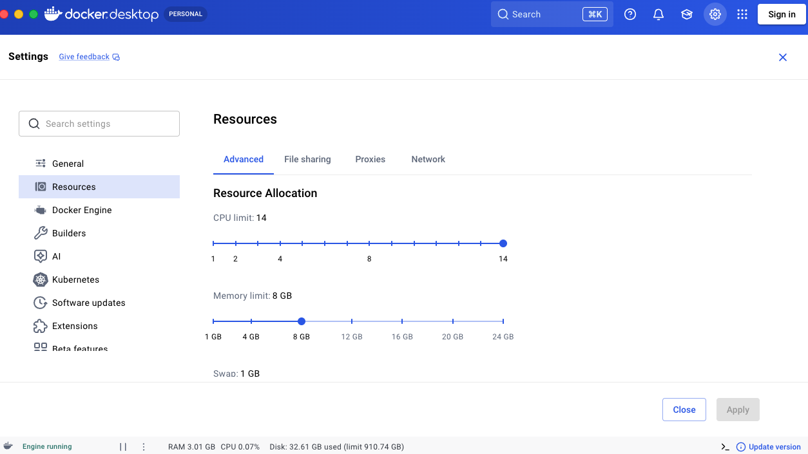

import { Steps, LinkCard } from '@astrojs/starlight/components';

This page collects problems people run into when running Ocelescope, and the solutions we currently recommend.

## Phenomena

These are the symptoms you might notice, what they usually mean, and how to get going again.

### The tool freezes mid-process and nothing works anymore

You are working as usual when Ocelescope suddenly stops responding. Nothing reacts anymore, and you notice that the built-in default OCELs are no longer offered in any upload dialog.

This means the **backend server has crashed**. To recover, use **Logout**. The backend comes back up and Ocelescope is usable again.

A crash like this is usually caused by a memory problem. See [Memory problem](#memory-problem) below.

### A large log or resource never finishes uploading

You upload a large OCEL or resource. It looks like it is loading for around 20 seconds, and then the screen looks exactly as it did before you started the upload, as if nothing happened. In some cases the backend crashes at the same time (see above).

It can be worth trying to upload the log in a **different file format** (for example `.xmlocel` or `.sqlite` instead of `.jsonocel`), as that occasionally helps. Most likely, though, the real cause is **insufficient memory**: the container has not been assigned enough memory to handle a log of that size.

:::note
When exactly this happens depends on your operating system, because different platforms allocate memory to containers differently. The same log may load fine on one machine and fail on another.
:::

The fix is to give the container more memory. See [Memory problem](#memory-problem) below.

## Current solutions

These are the fixes the phenomena above point to.

### Memory problem

Loading a log needs noticeably **more memory than the size of the log on disk**. The data is held in in-memory structures that are larger than the raw file, and some operations need to temporarily duplicate parts of the log while they run. As a result, a log that is a few hundred megabytes on disk can require several gigabytes of memory to load and analyze.

If Ocelescope crashes or uploads silently fail on large logs, increase the memory available to the backend container. There are two ways to do this.

#### Option 1: From the terminal

Find the backend container and raise its memory limit (here to 12 GB):

```bash
docker update --memory 12g --memory-swap 12g \
  $(docker ps -qf "ancestor=ghcr.io/promi4s/ocelescope-backend:latest")
```

To make the change permanent across restarts, add a memory limit to the backend service in your `docker-compose.yaml` instead:

```yaml title="docker-compose.yaml" {4}
services:
  backend:
    image: ghcr.io/promi4s/ocelescope-backend:latest
    mem_limit: 12g
    volumes:
      - plugins_store:/plugins
    restart: unless-stopped
```

Then apply it with `docker compose up -d`.


#### Option 2: Through Docker Desktop

<Steps>

1. Open **Docker Desktop**.

2. Click the **gear icon** in the top right to open **Settings**.

3. Go to **Resources**.

4. Increase the **Memory limit** slider, then click **Apply**.

</Steps>

<div
  style="
    display: inline-block;
    background: white;
    padding: 1rem;
    border-radius: 0.75rem;
  "
>
  
</div>

This is a known limitation of Python, which Ocelescope is built on. We are actively working on making the underlying code more memory-efficient so that large logs need less headroom.

<LinkCard
  title="Report a Bug"
  description="Ran into something not covered here? Let the maintainers know."
  href="/community/report-bug/"
/>
