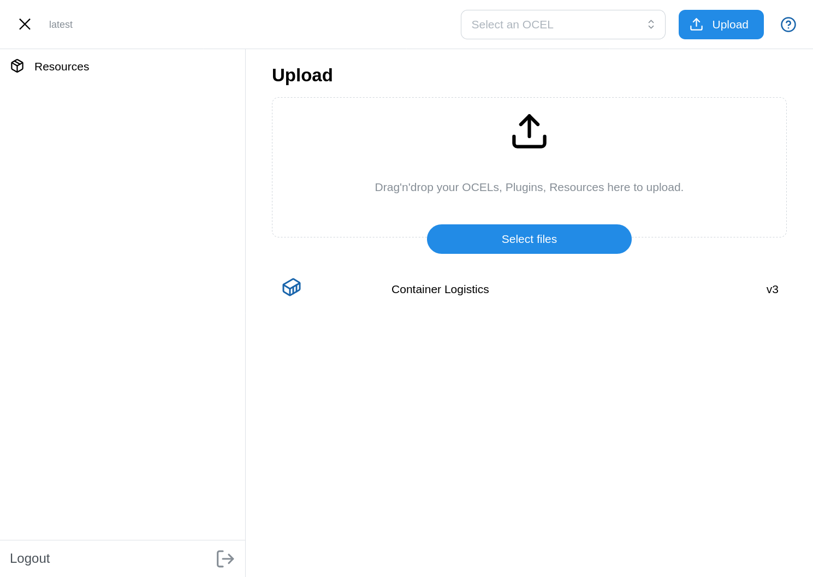

import { Steps } from '@astrojs/starlight/components';

Ocelescope's module system lets you create a separate tool based on the Ocelescope framework. Instead of reimplementing standard functionality from scratch, you can start from a minimal template and add the modules you need.

This page shows a simple example: start from the template, run it with only the management module, add the filter module, rebuild, and publish the result.

If you want to implement your own modules, see [Module Development](/module-development/).

## Prerequisites

Before you start, make sure you have:

- [Docker](https://www.docker.com/products/docker-desktop/)
- [`pnpm`](https://pnpm.io/installation)
- [`uv`](https://docs.astral.sh/uv/)

<Steps>

1. **Clone the template**

   We can use [Ocelescope module template](https://github.com/promi4s/ocelescope-module-template) as a starter point for creating our own Ocelescope-based tool or for developing new modules, lets start by cloning id:

   ```bash
   git clone https://github.com/promi4s/ocelescope-module-template
   cd ocelescope-module-template
   ```

1. **Try the template with Docker**

   The template is held minimal and only contains one module for managing ocels and resources. Lets run it first using the docker file:

   ```bash
   docker compose up --build
   ```

   This should build and run our current version at localhost:3000 and you should see this minimal application:
   

1. **Adding a module**

    Since the current state is not really usable we can now extend Ocelescope with one of the standard ocelescope modules. Like filtering which adds our application to fitler uploaded OCELs.
    To allow our module to use filtering we have to add the [`ocelescope-module-filter`](https://pypi.org/project/ocelescope-module-filter/) and the ["@ocelescope/filter"](https://www.npmjs.com/package/@ocelescope/filter) from npm.

    Lets start with adding the backend module:

    ``sh
    uv add ocelescope-module-filter
    ``

    To install the frontend module we can use:

    ``sh
    pnpm --filter @instance/app add @ocelescope/filter
    ``

    We also need to add the frontend module to our app by adding it in the config:

    (code of how to add it in the config)

1. **Build again**

    Lets test if everything worked by rebuild the application so the new module is included:

    ```bash
    docker compose down 
    docker compose up --build
    ```

    After rebuilding, the tool should now include the filter module in addition to the management module.

1. **Push the repository**

    Commit your changes and push them to GitHub:

    ```bash
    git add .
    git commit -m "Add filter module"
    git push origin main
    ```

1. **Publish using GitHub**

   Use the GitHub workflows included in the template to build and publish your tool.

   Once your repository is connected and configured, GitHub can be used as the place where your tool is built and released.

</Steps>
