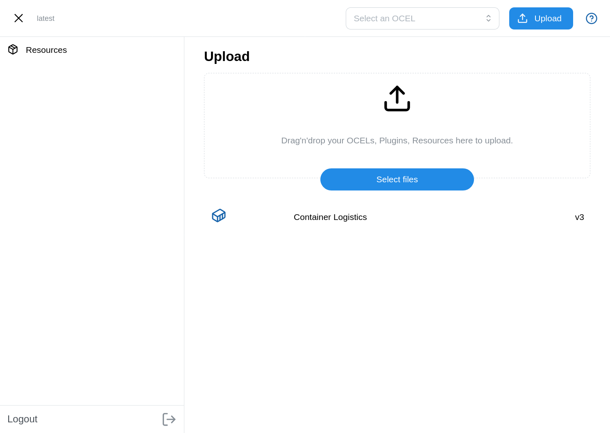
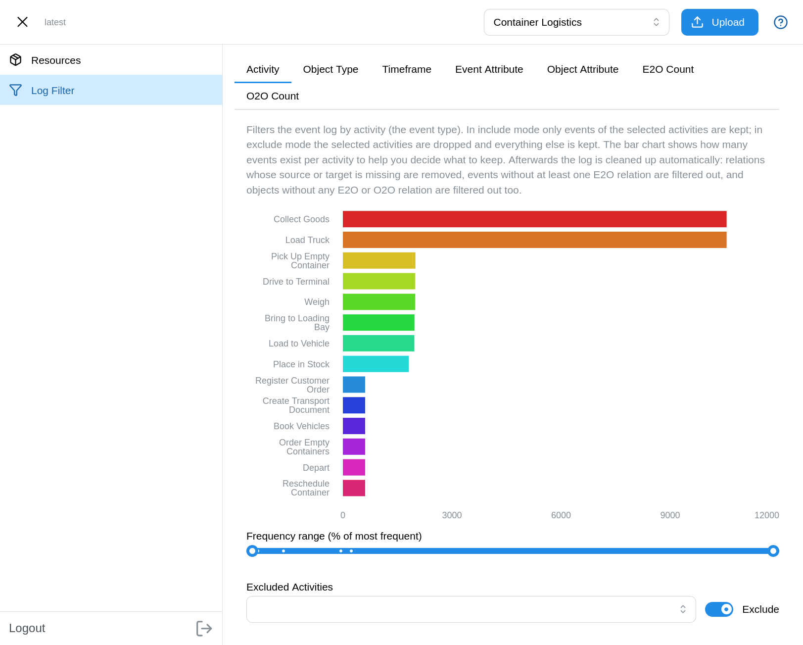

import { Steps } from '@astrojs/starlight/components';

Ocelescope is a modular framework for building process mining tools.
It can be used as a base for creating new tools by combining existing modules with your own extensions.
Instead of reimplementing standard functionality from scratch, you can start from a minimal setup and add the modules you need.

This page shows how to create an Ocelescope-based tool from the [minimal template](https://github.com/promi4s/ocelescope-module-template) and extend it with an existing Ocelescope module.

If you want to implement your own modules, see [Module Development](/module-development/). For the conceptual difference between plugins and modules, see [Modules](/ocelescope/modules/).

## Prerequisites

Before you start, make sure [Docker](https://www.docker.com/products/docker-desktop/), [`pnpm`](https://pnpm.io/installation), and [`uv`](https://docs.astral.sh/uv/) are installed.

## Step-by-step

<Steps>

1. **Start from the template**

   Use the [Ocelescope module template](https://github.com/promi4s/ocelescope-module-template) as the starting point for your repository. Then clone your repository locally:

   ```bash
   git clone git@github.com:promi4s/ocelescope-module-template.git

   cd ocelescope-module-template
   ```

1. **Try the template with Docker**

   The template is intentionally minimal and initially only contains the management module for working with OCELs and resources. Start by running it with Docker:

   ```bash
   docker compose up --build
   ```

   This builds and starts the current version at `http://localhost:3000`. You should see the minimal application shown below:

   

1. **Add the filter module**

   The current setup is intentionally small, so the next step is to extend it with an existing Ocelescope module.
   In this example, we add the filter module so uploaded OCELs can be filtered.
   If you want to explore other available modules, see the [Module Library](/module-development/module-library).

   To do that, add both the backend and frontend packages.

   First, add the backend module:

   ```bash
   uv add ocelescope-module-filter
   ```

   Then add the frontend module:

   ```bash
   pnpm --filter @instance/app add @ocelescope/filter
   ```

1. **Register the module in the app configuration**

   After installing the package, add the frontend module to `app/ocelescope.config.ts`.

   ```ts title="app/ocelescope.config.ts"
   import type { OcelescopeConfig } from "@ocelescope/core";
   import management from "@ocelescope/management";
   import filter from "@ocelescope/filter";

   export default {
     modules: [management, filter],
   } satisfies OcelescopeConfig;
   ```

   This defines which modules are available in your tool.

1. **Build again**

   Rebuild the application so the new module is included:

   ```bash
   docker compose down
   docker compose up --build
   ```

   After rebuilding, the tool should include the filter module in addition to the management module.

   
</Steps>

In this section, you created an Ocelescope-based tool from a minimal template and extended it with the filter module.
If you want a deeper introduction to the Ocelescope module system, see [Modules](/module-development/).
