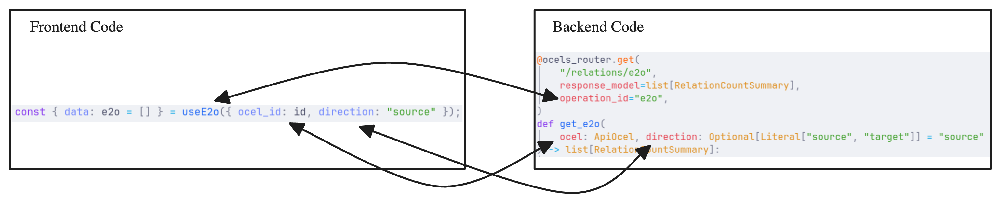

The frontend half of a module is a React package built with [tsdown](https://tsdown.dev/). It declares the module's metadata and its **routes**, and talks to the [backend module](/module-development/backend-module/) through a generated API client.

## Defining the module

Use `defineModule` from `@ocelescope/core` to describe the module and list its routes.

```ts title="src/config.ts"
import { defineModule } from "@ocelescope/core";
import { TelescopeIcon } from "lucide-react";
import summaryRoute from "./routes/summary";

export default defineModule({
  name: "example",
  label: "Example",
  description: "A short description of what the module does.",
  authors: [{ name: "Doe, Jane" }],
  routes: [summaryRoute],
  icon: TelescopeIcon,
});
```

The package's `index.ts` simply re-exports it as the default export:

```ts title="src/index.ts"
import exampleModule from "./config";

export default exampleModule;
```

## Defining routes

Each route is a page that mounts as a first-class view. Define it with `defineModuleRoute`.

```tsx title="src/routes/summary.tsx"
import { defineModuleRoute, useCurrentOcel } from "@ocelescope/core";
import { LoadingOverlay } from "@mantine/core";

const SummaryPage = () => {
  const { id } = useCurrentOcel();
  if (!id) return <LoadingOverlay />;
  return <div>Summary for {id}</div>;
};

export default defineModuleRoute({
  name: "summary",
  label: "Summary",
  requiresOcel: true,
  component: SummaryPage,
});
```

- `name` becomes the route's URL segment, under `/<module-name>/<route-name>`.
- `label` is shown in the navigation.
- `requiresOcel` gates the route on a log being selected; the app handles prompting the user when none is.
- `component` is the React component to render.

## Using shared building blocks

`@ocelescope/core` provides the hooks and components that integrate a route with the rest of the app, including `useCurrentOcel` for the active log, `OcelSelect` for choosing one, and download helpers. UI is built with [Mantine](https://mantine.dev/), the same component library used across Ocelescope.

## Calling the backend

The frontend talks to the backend module through a typed client generated with [orval](https://orval.dev/). Point its config at your output file:

```ts title="orval.config.ts"
import { defineConfig } from "@ocelescope/api-config";

export default defineConfig({
  base: {
    output: {
      target: "./src/api/base.ts",
    },
  },
});
```

Running the API generation step produces `src/api/base.ts` with a React Query hook per endpoint, named after each route's `operation_id`. Import these hooks in your routes; never edit the generated file by hand.

<div
  style="
    display: inline-block;
    background: white;
    padding: 1rem;
    border-radius: 0.75rem;
  "
>
  
</div>

```tsx
import { useGetObjectTypes } from "../api/base";

const { data: objectTypes } = useGetObjectTypes(ocelId);
```

## Building

The package builds with `tsdown` (`pnpm run build`), emitting an ES module plus types and CSS into `dist/`. With both halves built, continue to [Register a Module](/module-development/register-module/).
