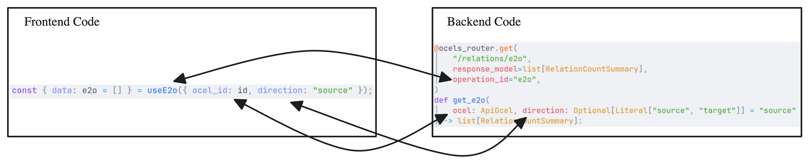

The frontend half of a module is a React package. It declares the module's metadata and its **routes**, and talks to the [backend module](/module-development/backend-module/) through a generated API client.

## Creating a frontend module

Like backend modules, frontend modules are generated by a script in the [module template](/module-development/structure/).
To create a frontend module, run the following from the repository root:

```bash
pnpm run add:frontend ocel-stats
```

`ocel-stats` is the name of the folder the module is created in. To create a frontend and a [backend module](/module-development/backend-module/) together, use `pnpm run add:module` instead.

The script uses [Copier](https://copier.readthedocs.io) to generate the module from the [frontend module template](https://github.com/promi4s/create-ocelescope-frontend-module). It asks for:

- the module's name, a short description and an author. With `add:module`, these are taken from the backend module.
- the npm package name, by default `@instance/<name>`.
- the key of the backend module to generate a typed API client for. It defaults to the key a backend module with the same name gets (`OCEL Stats` → `ocelStats`). Leave it empty for a frontend-only module.

The module is created in `frontend-modules/<folder>`:

```text
frontend-modules/ocel-stats/
├── src/
│   ├── lib/fetcher.ts   # Connects the API client to the Ocelescope backend
│   ├── routes/
│   │   └── Hello.tsx    # An example page
│   └── index.ts         # The module definition
├── .copier-answers.yml  # Your answers, used to update the module later
├── orval.config.ts      # Configuration of the generated API client
└── package.json
```

`src/lib/fetcher.ts` and `orval.config.ts` are only created when the module has a backend module to generate an API client for.

The script then registers the module with the app:

- it adds the package to the dependencies in `app/package.json`,
- it imports the module and adds it to `modules` in `app/ocelescope.config.ts`,
- it adds the module's sources to the `paths` in `app/tsconfig.json`, so the development server picks up changes without a rebuild.

Install it and start the development servers:

```bash
pnpm run sync
pnpm run dev
```

The module now appears in the navigation of the app at [`http://localhost:3000`](http://localhost:3000).

The following sections explain the generated files and how to extend them.

:::tip
To pull in later changes to the frontend module template, commit your work and run `uvx copier update` in the module's folder.
:::

## Defining the module

`src/index.ts` describes the module with `defineModule` from `@ocelescope/core` and exports it as the package's default export.

```ts title="src/index.ts"
import { defineModule, defineModuleRoute } from "@ocelescope/core";
import { SparklesIcon } from "lucide-react";
import Hello from "./routes/Hello";

const helloRoute = defineModuleRoute({
  name: "hello",
  label: "Hello",
  component: Hello,
});

export default defineModule({
  name: "ocelStats",
  label: "OCEL Stats",
  description: "An Ocelescope module",
  authors: [{ name: "Your Name" }],
  icon: SparklesIcon,
  routes: [helloRoute],
});
```

- `name` is the module's unique identifier and its URL segment in the app.
- `label`, `description` and `authors` are shown in the app.
- `icon` is an optional icon component, for example from [lucide-react](https://lucide.dev/).
- `routes` lists the module's pages.

## Defining routes

Each route is a page that is mounted as a view of the app. Define it with `defineModuleRoute`:

- `name` becomes the route's URL segment, under `/<module-name>/<route-name>`.
- `label` is shown in the navigation.
- `requiresOcel` (optional) disables the route in the navigation until an OCEL is available.
- `component` is the React component to render.

As the module grows, you can move each route definition into its own file under `src/routes/` and import it in `src/index.ts`.

## Using shared building blocks

`@ocelescope/core` provides the hooks and components that integrate a route with the rest of the app, including `useCurrentOcel` for the active log, `OcelSelect` for choosing one, and download helpers. UI is built with [Mantine](https://mantine.dev/), the same component library used across Ocelescope.

## Calling the backend

The frontend talks to the backend module through a typed client generated with [orval](https://orval.dev/).
The generated `orval.config.ts` points it at the backend module selected when the module was created:

```ts title="orval.config.ts"
import { defineConfig } from "@ocelescope/api-config";

export default defineConfig({
  ocelStats: {
    output: { target: "./src/api/ocelStats.ts" },
  },
});
```

`defineConfig` applies Ocelescope's shared orval defaults, so you only provide the output file.
The client is generated from the backend module's OpenAPI schema into `src/api/ocelStats.ts`, with one React Query hook per endpoint named after its `operation_id`.

<div
  style="
    display: inline-block;
    background: white;
    padding: 1rem;
    border-radius: 0.75rem;
  "
>
  
</div>

The generated `Hello.tsx` route uses the hook of the backend module's example `hello` endpoint:

```tsx title="src/routes/Hello.tsx"
import { useHello } from "../api/ocelStats";

export default function Hello() {
  const { data, isPending, isError } = useHello();

  return (
    <div>
      <h1>OCEL Stats</h1>
      <p>
        {isPending
          ? "Loading…"
          : isError
            ? "Could not reach the backend module."
            : data?.message}
      </p>
    </div>
  );
}
```

The client is generated, so never edit the files in `src/api/` by hand.
After changing the backend module's endpoints, regenerate it from the repository root:

```bash
pnpm run build:modules
```

## Working with the current OCEL

Most routes work on the OCEL the user has currently selected. `useCurrentOcel` from `@ocelescope/core` returns its id, which you pass to the generated hooks.

The hooks of the bundled `ocelescope-module-ocel` backend module are available in the [`@ocelescope/api-base`](https://www.npmjs.com/package/@ocelescope/api-base) package. To use them together with Mantine, add both packages to the `peerDependencies` and `devDependencies` in your module's `package.json`, then run `pnpm install`:

```json title="package.json"
"@mantine/core": "catalog:",
"@ocelescope/api-base": "catalog:",
```

The following route, based on the Log Overview module, lists the activities of the current OCEL and how often they occur:

```tsx title="src/routes/Activities.tsx"
import { LoadingOverlay, Table } from "@mantine/core";
import { useEventCounts } from "@ocelescope/api-base";
import { defineModuleRoute, useCurrentOcel } from "@ocelescope/core";

const ActivitiesPage = () => {
  const { id } = useCurrentOcel();
  const { data: eventCounts } = useEventCounts(id);

  if (!eventCounts) {
    return <LoadingOverlay />;
  }

  return (
    <Table>
      <Table.Tbody>
        {Object.entries(eventCounts).map(([activity, count]) => (
          <Table.Tr key={activity}>
            <Table.Td>{activity}</Table.Td>
            <Table.Td>{count}</Table.Td>
          </Table.Tr>
        ))}
      </Table.Tbody>
    </Table>
  );
};

export default defineModuleRoute({
  name: "activities",
  label: "Activities",
  requiresOcel: true,
  component: ActivitiesPage,
});
```

Add the route to `routes` in `src/index.ts` to show it in the app. Your own backend module's hooks work the same way once its endpoints take an OCEL, as described in [accessing the session and OCELs](/module-development/backend-module/#accessing-the-session-and-ocels).
