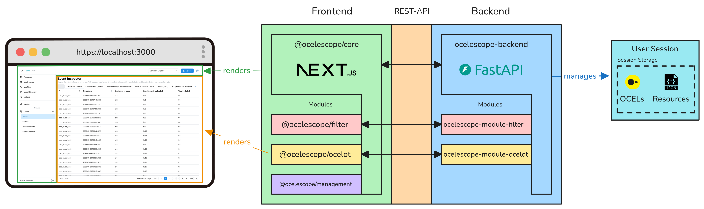
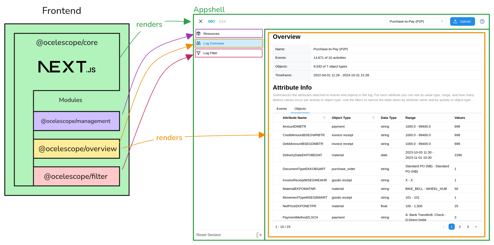
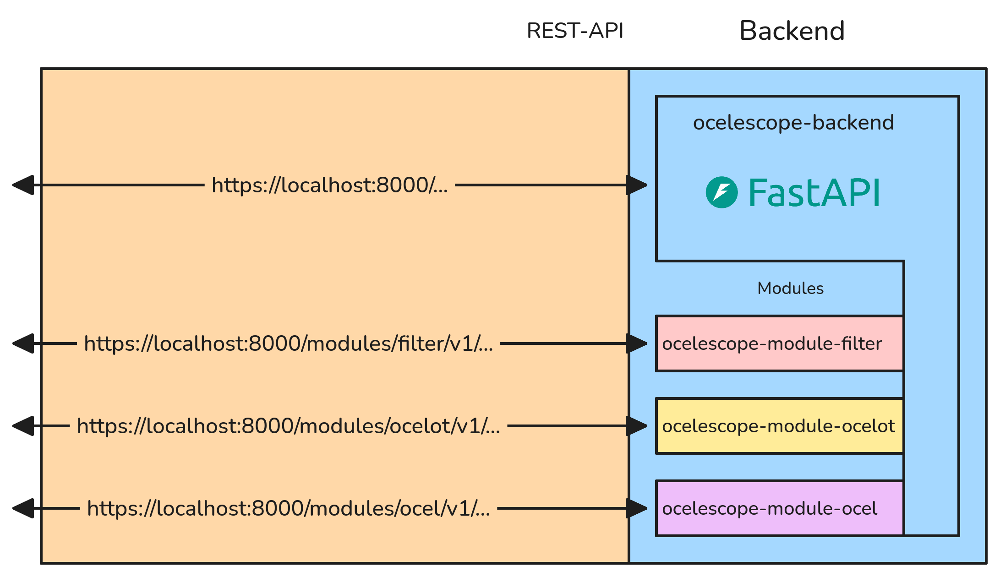

The ocelescope tool tool is designed in a modular way to allow the creation of specilized object-centric process mining tools.
This design was done by the current landscape of object centric process mining tools.
Many tools wrote their own application with each their own installation process and duplicate functionality like for instance
import and export of logs or the overview or filtering of logs. Ocelescope was written in a way to solve these problems.
It is written in a modular way based that implements base functionality like import and export of object centric event logs.
Developers for object-centric tools can then develop modules with new seperate functionality that can be then embedded in the main tool.
This allows you as a developer to focus on writing your functionality. Your module can be then used for your specilized tool in which
you can use other modules and the module can also be published to be used for other tools that use the ocelescope framework as a base.

## Structure Overview

The ocelescope framework is based on a frontend backend design.
The frontend is based on the popular react framework nextjs (while nextjs is used writing modules in most cases only requires react knowledge).
The backend module is using the fastapi framework in python.
Both of these framework are wrapped in the base packages.

### Frontend overview

The frontend is wrapped using the [@ocelescope/core](https://www.npmjs.com/package/@ocelescope/core) package which wraps a nextjs app. This creates the ocelescope base app
which renders the app shell and embedds integrated modules into the sidebar.
Frontend modules are just react views that then get integrated into appshell.

### Backend overview

The backend is wrapped using the [ocelescope-backend](https://pypi.org/project/ocelescope-backend/) python package.
This package ships a integrated fastapi router. The backend is where proces mining tasks are run.
The backend is sesion based meaning each user of the tool has a session in which multiple ocels and resources can be stored.
These can be then used to create process mining on. Modules in fastapi are subrouters which get integrated into the main api.
Each of these subrouters have then access to the session.

Frontend and backend are then comunicating through a RestAPI.

## Module development

To make module development and the creation of ocelescope based tools we strongly recommend using the [ocelescope template](https://github.com/promi4s/ocelescope-module-template) as a starting point.
A guide on how to create your own tool is also available in the [Getting started](/getting-started/loading-modules/) section.
All the following section also are using this template as a base.
