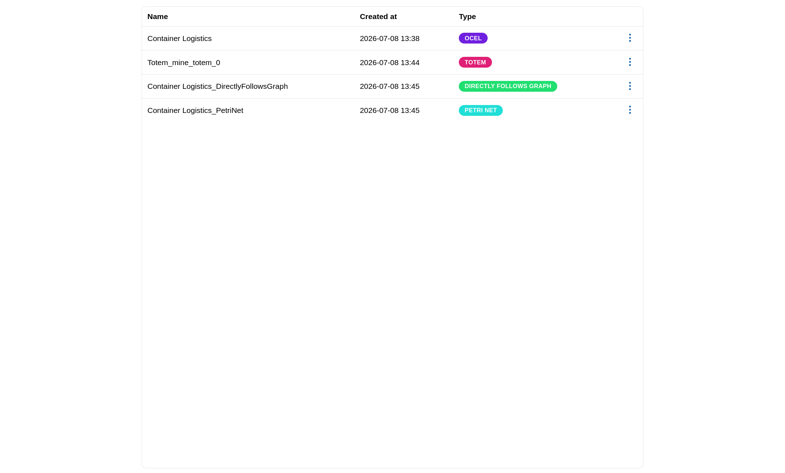
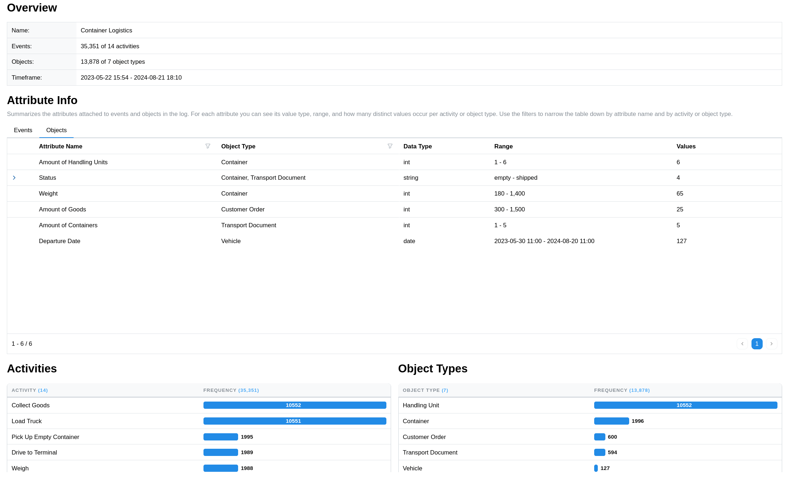
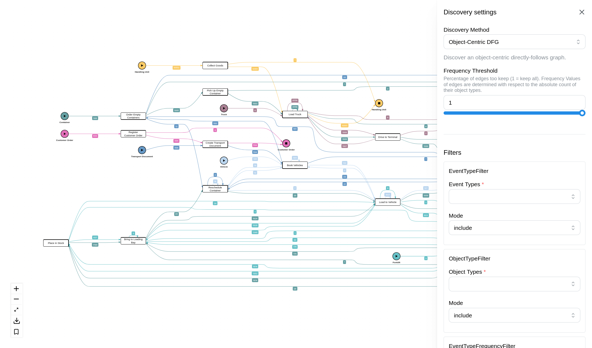
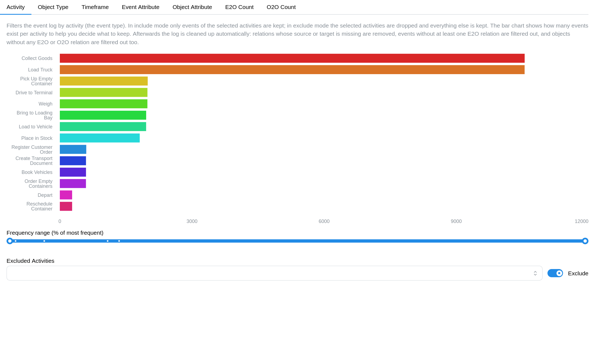
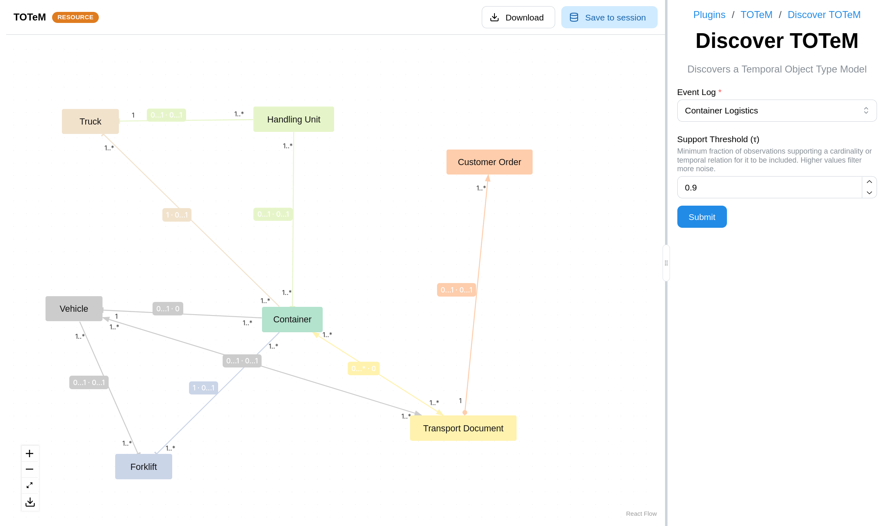
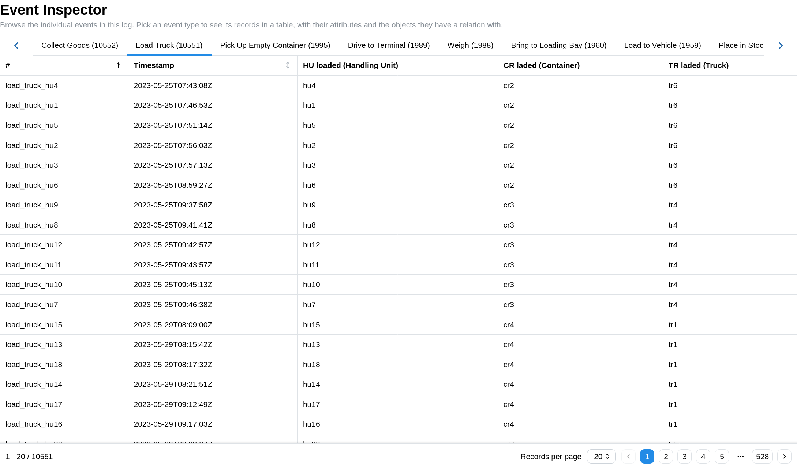

import { Image } from 'astro:assets';

Each module listed here can be integrated into an Ocelescope-based tool as described in [Create an Ocelescope-Based Tool](/getting-started/loading-modules/).

## Management

Manage OCELs and resources: upload logs, inspect them, and organize the resources derived from them.
This is the minimal module included in the [module template](https://github.com/promi4s/ocelescope-module-template).

- **Frontend package:** [`@ocelescope/management`](https://www.npmjs.com/package/@ocelescope/management)
- **Source:** [`src/frontend/modules/management`](https://github.com/promi4s/ocelescope/tree/main/src/frontend/modules/management)

## Log Overview

A high-level summary of OCELs, including its key statistics and structure at a glance.

- **Frontend package:** [`@ocelescope/log-overview`](https://www.npmjs.com/package/@ocelescope/log-overview)
- **Source:** [`src/frontend/modules/log-overview`](https://github.com/promi4s/ocelescope/tree/main/src/frontend/modules/log-overview)

## Discovery

Process discovery: derive and visualize process models from OCELs.

- **Frontend package:** [`@ocelescope/discovery`](https://www.npmjs.com/package/@ocelescope/discovery)
- **Source:** [`src/frontend/modules/discovery`](https://github.com/promi4s/ocelescope/tree/main/src/frontend/modules/discovery)

## Filter

Filter uploaded OCELs.
Every other view then works on the filtered version of the log until the filter is removed.
This is the module added in the [Create an Ocelescope-Based Tool](/getting-started/loading-modules/) walkthrough.

- **Frontend package:** [`@ocelescope/filter`](https://www.npmjs.com/package/@ocelescope/filter)
- **Backend package:** [`ocelescope-module-filter`](https://pypi.org/project/ocelescope-module-filter/)
- **Frontend source:** [`src/frontend/modules/filter`](https://github.com/promi4s/ocelescope/tree/main/src/frontend/modules/filter)
- **Backend source:** [`src/backend/modules/ocelescope-module-filter`](https://github.com/promi4s/ocelescope/tree/main/src/backend/modules/ocelescope-module-filter)

## Plugin

Plugin runner: run installed [plugins](/ocelescope/plugins/) through their generated forms and view their results.

- **Frontend package:** [`@ocelescope/plugin`](https://www.npmjs.com/package/@ocelescope/plugin)
- **Source:** [`src/frontend/modules/plugin`](https://github.com/promi4s/ocelescope/tree/main/src/frontend/modules/plugin)

## Ocelot

An Ocelescope adaptation of the [Ocelot](https://ocelot.pm/) tool for interactively exploring how individual events and objects relate, searching entities, and visualizing their relationships as a graph.
Ocelot is bundled into the default Ocelescope images, so it is available out of the box without a custom build.

- **Frontend package:** [`@ocelescope/ocelot`](https://www.npmjs.com/package/@ocelescope/ocelot)
- **Backend package:** [`ocelescope-module-ocelot`](https://pypi.org/project/ocelescope-module-ocelot/)
- **Source:** [`promi4s/ocelescope`](https://github.com/promi4s/ocelescope)
