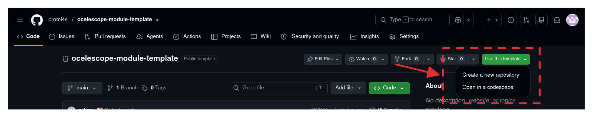

import { Steps } from '@astrojs/starlight/components';
import { Image } from 'astro:assets';
import managementModule from '../../../assets/modulesGuide/management-module.png';

As described in the [overview](/module-development/), Ocelescope is a web application consisting of a frontend and a backend.
This page explains how an Ocelescope-based tool is structured, using the [Ocelescope module template](https://github.com/promi4s/ocelescope-module-template) as an example, and how modules are added to it.

## Getting the template

You can either clone the template repository:

```sh
git clone https://github.com/promi4s/ocelescope-module-template.git
```

Or create your own repository from it on GitHub by selecting **Use this template**:



## Structure of the template

The template is a single repository that contains everything needed to build and run an Ocelescope-based tool.

```text
.
├── app/                 # Next.js frontend application
├── backend-modules/     # Local backend modules (Python packages)
├── frontend-modules/    # Local frontend modules (pnpm packages)
├── data/                # Default OCELs offered in the upload dialog
├── docker/
├── scripts/             # Scripts to create new modules from templates
├── compose.yaml
├── docker-bake.hcl
├── package.json
├── pnpm-workspace.yaml
├── pyproject.toml
└── .env.example
```

New backend and frontend modules are created from templates using the scripts in `scripts/`.
How to create and develop them is explained in [Backend Module](/module-development/backend-module/) and [Frontend Module](/module-development/frontend-module/).

## Frontend

The `app` directory contains a Next.js application that is already configured as an Ocelescope frontend through the [`@ocelescope/core`](https://www.npmjs.com/package/@ocelescope/core) package.
In most cases, the only file you need to change is `app/ocelescope.config.ts`, which defines the frontend modules available in your tool.

The frontend is managed as a [pnpm workspace](https://pnpm.io/workspaces) that includes the application in `app` and all local frontend modules in `frontend-modules`.

To add a frontend module:

<Steps>

1. Add the module as a dependency of the `app` package:

   ```bash
   pnpm --filter @instance/app add @ocelescope/example-module
   ```

   Replace `@ocelescope/example-module` with the package name of the module you want to use.

2. Import and register the module in `app/ocelescope.config.ts`:

   ```ts title="app/ocelescope.config.ts"
   import type { OcelescopeConfig } from "@ocelescope/core";
   import exampleModule from "@ocelescope/example-module";

   export default {
     modules: [exampleModule],
   } satisfies OcelescopeConfig;
   ```

</Steps>

## Backend

The backend is provided by the [`ocelescope-backend`](https://pypi.org/project/ocelescope-backend/) package, which the template uses as its base application.
Backend modules are Python packages that extend this application with their own functionality. Local backend modules are stored in `backend-modules`.

To add a backend module, run the following from the repository root:

```bash
uv add ocelescope-module-example
```

Replace `ocelescope-module-example` with the package name of the module you want to use.

If a module with this name exists in `backend-modules`, `uv` uses the local workspace package. Otherwise, it installs the package from a Python package registry.
Once added, Ocelescope discovers and loads the module automatically when the backend starts.

## Management and default OCELs

The template already includes the [`@ocelescope/management`](https://www.npmjs.com/package/@ocelescope/management) frontend module and the [`ocelescope-module-ocel`](https://pypi.org/project/ocelescope-module-ocel/) backend module.
Together, they provide a management view as the start page of your tool, where users can import, inspect and export OCELs and resources.

They also let you ship default OCELs: event logs that users can load into their session with a single click.
This is a good way to give users ready-made logs that fit your specific application.
The default OCELs are listed below the dropzone in the upload dialog:

<Image
  src={managementModule}
  alt="The upload dialog of the management module, with the default OCELs listed below the dropzone"
  width={560}
  style={{ display: "block", margin: "0 auto" }}
/>

Default OCELs are stored in the `data` directory and listed in `data/event_logs.json`:

```json title="data/event_logs.json"
{
  "base_path": "event_logs",
  "event_logs": [
    {
      "key": "container-logistics",
      "name": "Container Logistics",
      "version": "3",
      "file": "container_logistics.db",
      "url": "https://doi.org/10.5281/zenodo.18373888"
    }
  ]
}
```

- `base_path` is the directory, relative to `data`, that contains the event log files.
- `key` and `version` identify the log.
- `name` is the name shown to users.
- `file` is the file name of the log inside `base_path`.
- `url` is an optional link to the source of the log.

To add a default OCEL:

<Steps>

1. Convert the log to the DuckDB format used by Ocelescope with the [`ocelescope`](/ocelescope/ocelescope-library/) package. OCEL 2.0 logs in SQLite, JSON and XML are supported:

   ```python
   from ocelescope.ocel.io import convert_ocel_duckdb

   convert_ocel_duckdb("my_log.sqlite", "data/event_logs/my_log.db")
   ```

2. Add an entry for the log to `data/event_logs.json`:

   ```json
   {
     "key": "my-log",
     "name": "My Log",
     "version": "1",
     "file": "my_log.db"
   }
   ```

</Steps>

The backend reads the default OCELs from the directory set in the `DATA_DIR` environment variable.
When running the backend locally, set `DATA_DIR="data"` in your `.env` file.
With Docker, the `data` directory is copied into the backend image, so rebuild the backend after changing it.
