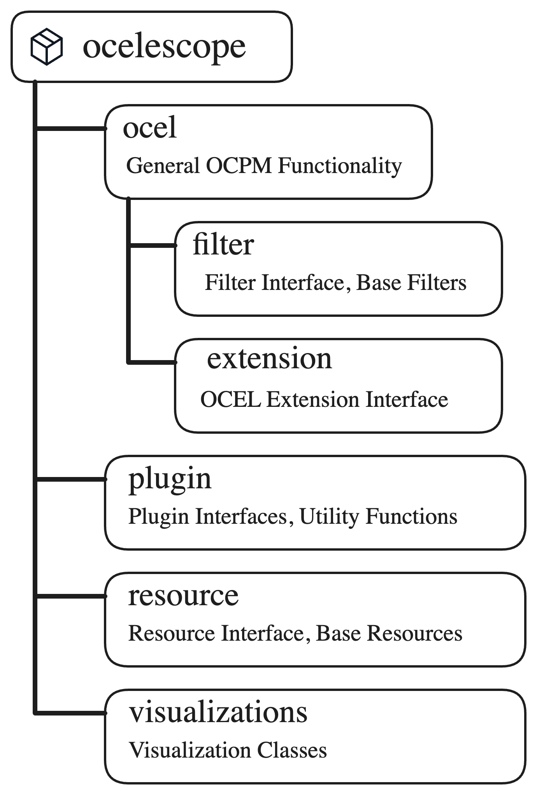

import { LinkCard } from '@astrojs/starlight/components';

`ocelescope` is the Python package at the heart of the project.
It provides general tools for working with object-centric event logs and the base classes you use to build [plugins](/plugin-development/).
The backend depends on it, and every plugin imports from it, so the same data model and types are shared end to end.

## Why it matters for plugins

Because the backend, the base tool, and every plugin all build on the same `ocelescope` types, a plugin never has to parse a log format or invent its own data model. You declare a [method](/plugin-development/plugin-class/) that takes an `OCEL` and/or `Resource` objects and returns `Resource` objects, write the analysis in plain Python against the managers described below, and Ocelescope takes care of the rest: loading the log, generating the input form, serializing results, and rendering visualizations.

In short, the library is the contract between your plugin and the rest of Ocelescope. Learning your way around it is most of what it takes to build a plugin. The log's data is exposed primarily as [pandas](https://pandas.pydata.org/) DataFrames, so you work with tools you likely already know.

## Installation

```bash
pip install ocelescope
```

When developing a plugin, install the optional `plugin` extra, which adds the packages available in the shared plugin environment:

```bash
pip install "ocelescope[plugin]"
```

## What it ships

The package is organized into focused subpackages, each covering one part of the object-centric process mining workflow.

<div
  style="
    width: 40%;
    margin: 0 auto;
    background: white;
    padding: 1rem;
    border-radius: 0.75rem;
  "
>
  
</div>

Everything below is importable directly from the top-level `ocelescope` package.

- **The `OCEL` class.** A high-level wrapper around an OCEL 2.0 log. It reads and writes `.jsonocel`, `.xmlocel`, and `.sqlite` files (and imports XES), and exposes structured **managers** for objects, events, event-to-object and object-to-object relations, attributes, executions, and extensions.
- **Filters.** A set of `BaseFilter` subclasses (such as `EventTypeFilter`, `ObjectAttributeFilter`, `TimeFrameFilter`, `E2OCountFilter`) that can be composed into a pipeline and applied with `OCEL.filter(...)`.
- **Plugin building blocks.** `Plugin`, the `@plugin_method` decorator, `PluginInput`, `OCEL_FIELD`, `COMPUTED_SELECTION`, and the `OCELAnnotation` / `ResourceAnnotation` helpers used to declare plugin methods and their inputs.
- **Resources.** The `Resource` base class plus built-in resources such as `PetriNet` and `DirectlyFollowsGraph`.
- **Visualizations.** Visualization types (`Graph`, `Table`, `DotVis`, `SVGVis`, and Plotly support) and layout helpers used to render resources in the frontend.
- **OCEL extensions.** `OCELExtension`, for storing extra data alongside an OCEL beyond the OCEL 2.0 standard.

## Capabilities at a glance

At a high level, the library lets you:

- **Read and write logs** in all OCEL 2.0 formats (`.jsonocel`, `.xmlocel`, `.sqlite`), and convert to and from traditional XES.
- **Inspect a log's structure**: list object types and activities with their counts, and get per-type attribute summaries (value types, ranges, and distinct values).
- **Navigate relations**: explore event-to-object and object-to-object relations, including their qualifiers, for example finding all events of an object, its first or last event, or which types relate to which.
- **Track dynamic attributes**: read object attribute values that change over the course of the log, not just static ones.
- **Compute process executions and variants**: derive object-centric process executions and group them into variants.
- **Filter logs**: compose `BaseFilter` subclasses into a pipeline and apply them to obtain a reduced log.
- **Define artifacts and visualizations**: create your own `Resource` types that serialize to JSON automatically and render through built-in visualization classes.
- **Extend OCEL files**: attach and persist extra data beyond the OCEL 2.0 standard with OCEL extensions.

Find out more about the library:

<LinkCard
  title="API References"
  description="The generated reference for every ocelescope class and helper."
  href="/api-references/"
/>
