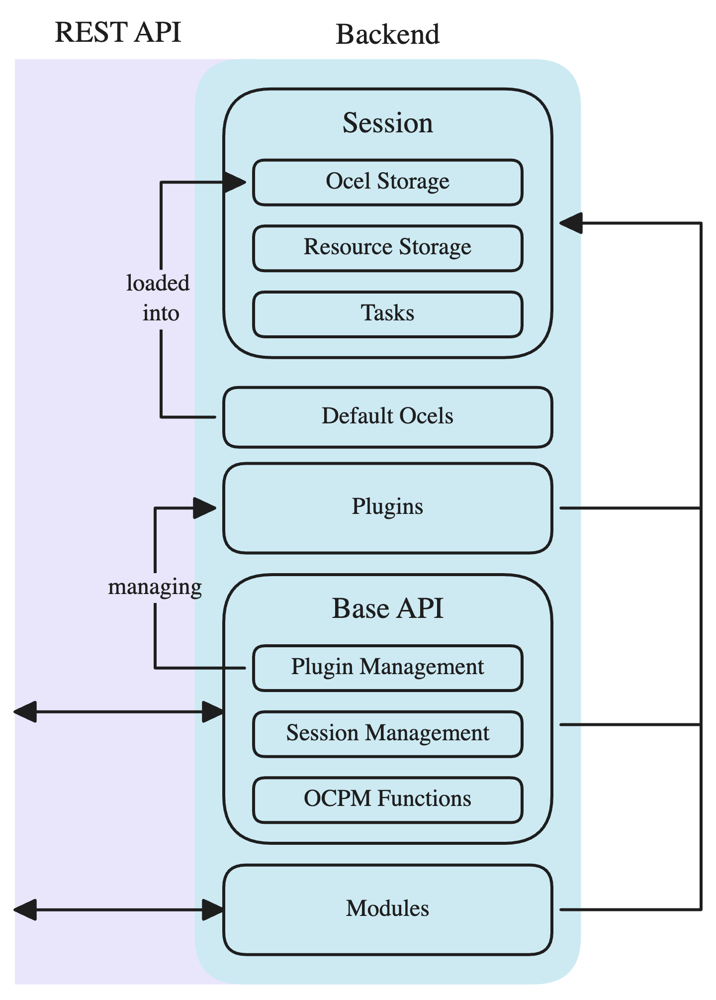

Ocelescope is a self-hosted web application for object-centric process mining. It is made of a small set of parts that work together, and two extension mechanisms (plugins and modules) layered on top.

## The two services

A running Ocelescope is two containers, started together with Docker Compose:

- **Backend** (`ocelescope-backend`): a Python [FastAPI](https://fastapi.tiangolo.com/) service. It manages user **sessions**, stores uploaded **OCELs** and **resources**, runs **plugin** methods, and exposes everything over a REST API. It builds on the [`ocelescope` Python library](/ocelescope/ocelescope-library/), which provides the OCEL data model, filters, resources, and visualizations.
- **Frontend** (`ocelescope-frontend`): a [Next.js](https://nextjs.org/) web app. It renders the UI, calls the backend through a generated API client, and shows logs, generated plugin forms, and results.

The frontend never touches your data directly; it asks the backend, and the backend keeps everything on the machine it runs on.

## What lives in the backend

  

- **Sessions and storage.** Each session holds the OCELs you upload and the resources produced by analyses.
- **The plugin runtime.** Uploaded plugins are stored in a volume and executed in a fixed Python [environment](/plugin-development/environment/).
- **The generated API.** Backend routes and schemas drive an OpenAPI specification, from which the frontend's typed API client is generated.

## What lives in the frontend

The UI is composed of **modules**, each contributing one or more views. The built-in modules make up the [base tool](/ocelescope/base-tool/): log overview, filtering, discovery, resource management, and the plugin interface.

## The two ways to extend Ocelescope

| | [Plugins](/ocelescope/plugins/) | [Modules](/ocelescope/modules/) |
| :--- | :--- | :--- |
| What they add | Process mining functions and artifacts | Full custom views with their own API |
| How they load | Uploaded at runtime as a ZIP | Compiled into the backend and frontend build |
| UI | Generated automatically from the method signature | Shipped by the module as React components |
| Backend | Run in the shared plugin runtime | Mount their own FastAPI sub-app |

Plugins are the lightweight path for sharing a method; modules are the heavier path when a generated form is not enough and you need a bespoke interface.
