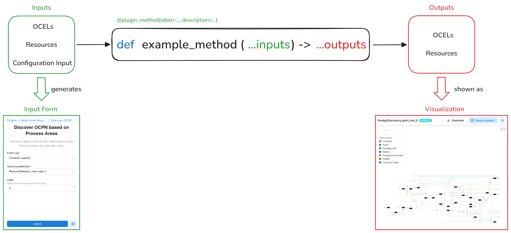
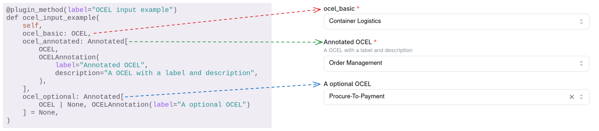
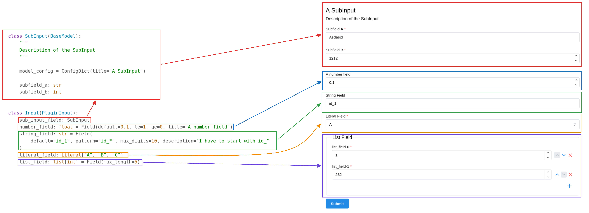
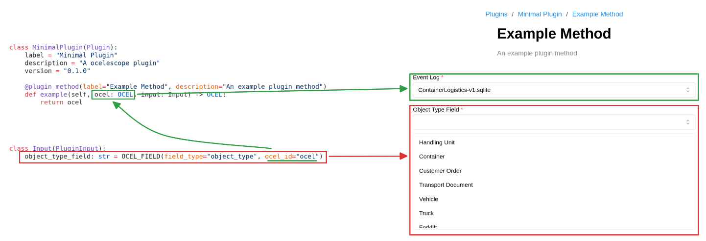
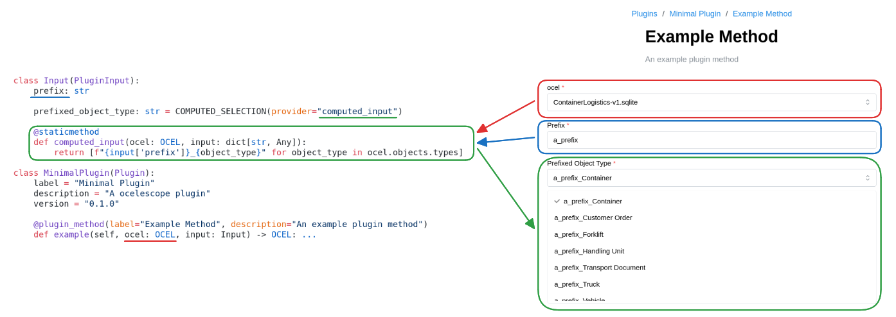

Plugins are defined by a **single plugin class** that inherits from the `Plugin` base class provided by the Ocelescope Python package.

A plugin class contains:

- **Metadata** (e.g., label, description, version) that is displayed in the frontend’s plugin interface.
- **Runnable functions** (plugin methods) that can be invoked from within Ocelescope.

<div
  style="
    display: inline-block;
    background: white;
    padding: 1rem;
    border-radius: 0.75rem;
  "
>
  
</div>

Each plugin package must export **exactly one** plugin class via its `__init__.py`.

:::note[An example plugin]

```py title="plugin.py"
from ocelescope import OCEL, PetriNet, Plugin, plugin_method

class DiscoveryPlugin(Plugin):
    label = "Discovery Plugin"
    description = "An Ocelescope plugin"
    version = "1.0.0"

    @plugin_method(
        label="Discover Petri Net",
        description="Discover an object-centric Petri net",
    )
    def discover_ocpn(self, ocel: OCEL) -> PetriNet: ...
```

```py title="__init__.py"
from .plugin import DiscoveryPlugin

__all__ = [
    "DiscoveryPlugin",
]
```

:::

## Plugin Methods

Plugin methods are the **object-centric process mining (OCPM)** operations a plugin offers.
Each one is a method on the plugin class, decorated with `@plugin_method` from the `ocelescope` package.

A plugin method takes OCELs, [Resources](/ocelescope/resources/) (process mining artifacts such as Petri nets) and an optional configuration input, and returns OCELs and/or Resources.
Ocelescope generates an input form from the method's signature and shows each returned value with its visualization.



:::tip[Some example plugin methods]

```py
from ocelescope import OCEL, PetriNet, Plugin, plugin_method

from .custom_resources import ConformanceResult, Variant


class DiscoveryPlugin(Plugin):
    ...

    @plugin_method(
        label="Discover Petri Net",
        description="Discover an object-centric Petri net",
    )
    def discover_ocpn(self, ocel: OCEL) -> PetriNet: ...

    @plugin_method(
        label="Discover Variants",
        description="Discover variants",
    )
    def discover_variants(self, ocel: OCEL) -> list[Variant]: ...

    @plugin_method(
        label="Alignment-based Conformance",
        description="Compute alignment-based conformance",
    )
    def conformance_alignment(
        self,
        petri_net: PetriNet,
        variants: list[Variant],
    ) -> ConformanceResult: ...
```

:::

### Input Definition

The parameters of a plugin method define its inputs. A method can take:

- any number of **OCELs**
- any number of **Resources**
- at most one **configuration input**

Ocelescope builds the method's input form from these parameters, together with the label and description passed to `@plugin_method`.


#### OCEL Inputs

To accept an OCEL, type a parameter as `OCEL` from the `ocelescope` package. A method can take any number of them.

By default the form uses the parameter name as the field label. To set a label and description, wrap the type in `Annotated` with an `OCELAnnotation`.
To make an OCEL optional, type it as `OCEL | None` and give it a default of `None`.



:::tip[Example OCEL inputs]

```py
from typing import Annotated

from ocelescope import OCEL, OCELAnnotation, plugin_method

@plugin_method(label="OCEL input example")
def ocel_input_example(
    self,
    ocel_basic: OCEL,
    ocel_annotated: Annotated[
        OCEL,
        OCELAnnotation(
            label="Annotated OCEL",
            description="An OCEL with a label and description",
        ),
    ],
    ocel_optional: Annotated[
        OCEL | None, OCELAnnotation(label="An optional OCEL")
    ] = None,
) -> OCEL: ...
```

:::

#### Resource Inputs

Resources represent process mining artifacts such as Petri nets or directly-follows graphs. A method can take any number of Resources, of the same or different types.

You can use the Resources the `ocelescope` package already provides or [define your own](/ocelescope/resources/).
They work like OCEL inputs: annotate them with `ResourceAnnotation` to set a label and description, and use `| None = None` to make them optional.

:::tip[Example Resource inputs]

```py
from typing import Annotated

from ocelescope import DirectlyFollowsGraph, PetriNet, ResourceAnnotation, plugin_method

@plugin_method(label="Resource input example")
def resource_input_example(
    self,
    resource_basic: PetriNet,
    resource_annotated: Annotated[
        DirectlyFollowsGraph, ResourceAnnotation(label="An annotated DFG input")
    ],
    resource_optional: PetriNet | None = None,
) -> PetriNet: ...
```

:::

#### Configuration Inputs

In addition to `Resource` and `OCEL` parameters, a plugin method can define **one extra configuration parameter** of type `PluginInput`.

Use a `PluginInput` when your method needs **user-provided settings**, for example:

- a **noise threshold** between `0` and `1`
- selecting a **leading object type** for computing process executions
- toggles, lists, or other algorithm parameters

Configuration settings are grouped into a **single class** that inherits from `PluginInput` (from the Ocelescope Python package).  
Each setting is defined as a **class field** and can be a `str`, `bool`, number, `list`, or even another Pydantic model.

To make inputs easier to use in the UI, you can add:

- **metadata** (title, description, etc.), and
- **constraints** (min/max values, patterns, list length, ...)

You do this with Pydantic’s [`Field`](https://docs.pydantic.dev/latest/concepts/fields/) helper.

**Important:** Each plugin method can have **exactly one** `PluginInput` parameter, and it **must be named `input`**.

<div
  style="
    display: inline-block;
    background: white;
    padding: 1rem;
    border-radius: 0.75rem;
  "
>
  
</div>

<details>
<summary><strong>An Example PluginInput</strong></summary>

```py
from typing import Annotated, Literal

from ocelescope import OCEL, OCELAnnotation, Plugin, PluginInput, plugin_method
from pydantic import BaseModel, ConfigDict, Field

class SubInput(BaseModel):
    """Description of the SubInput."""

    model_config = ConfigDict(title="A SubInput")

    subfield_a: str
    subfield_b: int

class Input(PluginInput):
    sub_input_field: SubInput

    number_field: float = Field(
        default=0.1,
        ge=0,
        le=1,
        title="A number field",
    )

    string_field: str = Field(
        default="id_1",
        pattern=r"^id_",
        max_length=10,
        description="A string that has to start with id_",
    )

    literal_field: Literal["A", "B", "C"]

    list_field: list[int] = Field(max_length=5)

class MinimalPlugin(Plugin):
    label = "Minimal Plugin"
    description = "An Ocelescope plugin"
    version = "0.1.0"

    @plugin_method(label="Example Method", description="An example plugin method")
    def example(
        self,
        ocel: Annotated[OCEL, OCELAnnotation(label="Event Log")],
        input: Input,  # must be named `input`
    ) -> OCEL:
        ...
```

</details>

#### OCEL Fields

OCEL fields let you populate configuration inputs with values taken directly from the selected OCEL, for example:

- available **object types**
- available **event types / activities**
- **event IDs** and **object IDs**
- available **event/object attribute names**

You define these fields with `OCEL_FIELD`. It works similarly to Pydantic’s `Field`, but instead of only validating user input, it **connects the input to the OCEL** so the UI can offer dropdowns/autocomplete based on the log.

**Important:** The `ocel_id` must match the name of the `OCEL` parameter in your plugin method (usually `ocel`). Otherwise, the field cannot be linked to the selected log.

<div
  style="
    display: inline-block;
    background: white;
    padding: 1rem;
    border-radius: 0.75rem;
  "
>
  
</div>

<details>
<summary><strong>Using `OCEL_FIELD`</strong></summary>

```python
from typing import Annotated

from ocelescope import OCEL, OCEL_FIELD, OCELAnnotation, Plugin, PluginInput, plugin_method

class Input(PluginInput):
    object_type_field: str = OCEL_FIELD(field_type="object_type", ocel_id="ocel")
    object_type_list_field: list[str] = OCEL_FIELD(field_type="object_type", ocel_id="ocel")

    event_type_field: str = OCEL_FIELD(field_type="event_type", ocel_id="ocel")

    event_id_field: str = OCEL_FIELD(field_type="event_id", ocel_id="ocel")
    object_id_field: str = OCEL_FIELD(field_type="object_id", ocel_id="ocel")

    object_attribute_field: str = OCEL_FIELD(field_type="object_attribute", ocel_id="ocel")
    event_attribute_field: str = OCEL_FIELD(field_type="event_attribute", ocel_id="ocel")

class MinimalPlugin(Plugin):
    label = "Minimal Plugin"
    description = "An Ocelescope plugin"
    version = "0.1.0"

    @plugin_method(label="Example Method", description="An example plugin method")
    def example(
        self,
        ocel: Annotated[OCEL, OCELAnnotation(label="Event Log")],
        input: Input,  # must be named `input`
    ) -> OCEL:
        ...
```

</details>

#### Computed Inputs

Computed inputs are fields whose available values are generated dynamically from the **current state of the input form**.

They are useful when the options depend on what the user has already entered, for example, generating a list of values based on a prefix, or filtering choices based on earlier selections.

Computed inputs are defined with `COMPUTED_SELECTION`. You provide the name of a **provider function** (as a string). Ocelescope calls that function whenever the user changes the form, and uses the returned list as the selectable values.

<div
  style="
    display: inline-block;
    background: white;
    padding: 1rem;
    border-radius: 0.75rem;
  "
>
  
</div>

<details>
<summary><strong>Using a `COMPUTED_SELECTION`</strong></summary>

```python
from typing import Any

from ocelescope import COMPUTED_SELECTION, OCEL, Plugin, PluginInput, plugin_method

class Input(PluginInput):
    prefix: str

    prefixed_object_type: str = COMPUTED_SELECTION(provider="computed_input")

    @staticmethod
    def computed_input(ocel: OCEL, input: dict[str, Any]):
        return [f"{input['prefix']}_{object_type}" for object_type in ocel.objects.types]

class MinimalPlugin(Plugin):
    label = "Minimal Plugin"
    description = "An Ocelescope plugin"
    version = "0.1.0"

    @plugin_method(label="Example Method", description="An example plugin method")
    def example(self, ocel: OCEL, input: Input) -> OCEL:
        ...
```

</details>

### Output Definition

The return type annotation of a plugin method defines its outputs. A method can return:

- an **OCEL**, for example a filtered or enriched log
- a **Resource**, such as a `PetriNet` or one of your own Resources
- a **list** of OCELs or of Resources, for example `list[Variant]`
- **several outputs at once**, written as a `tuple[...]` of the types above

Ocelescope adds each returned OCEL to the available logs, and shows each returned Resource with its visualization.

**Important:** The return type annotation is required, and it may only contain `OCEL`, `Resource` subclasses, `list[...]`, `T | None` and `tuple[...]`. Any other type raises a `TypeError` when the plugin is loaded.

:::tip[Example outputs]

```py
from ocelescope import OCEL, PetriNet, Plugin, plugin_method

from .custom_resources import ConformanceResult, Variant


class ExamplePlugin(Plugin):
    ...

    # A single OCEL
    @plugin_method(label="Filter Log")
    def filter_log(self, ocel: OCEL) -> OCEL: ...

    # A single Resource
    @plugin_method(label="Discover Petri Net")
    def discover_ocpn(self, ocel: OCEL) -> PetriNet: ...

    # A list of Resources
    @plugin_method(label="Discover Variants")
    def discover_variants(self, ocel: OCEL) -> list[Variant]: ...

    # Several outputs at once
    @plugin_method(label="Discover and Check")
    def discover_and_check(self, ocel: OCEL) -> tuple[PetriNet, ConformanceResult]:
        petri_net = ...
        result = ...
        return petri_net, result
```

:::
