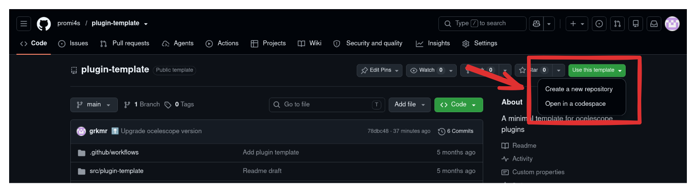

import { Tabs, TabItem } from '@astrojs/starlight/components';

Plugins are packaged as Python modules and distributed as `.zip` archives.

:::note[Example Ocelescope plugin structure]

```sh
plugin.zip/
└── plugin/
    ├── __init__.py  # Entry point
    ├── plugin.py
    └── util/
        ├── discovery.py
        └── ...
```

:::

The `__init__.py` file serves as the plugin's entry point.

## Available Templates

There are two ways to start a new plugin. For a full walkthrough of what to do once the project is set up, see the [plugin tutorial](tutorial-plugin-development#step-1-setup).

### Copier Template (Recommended)

The [copier](https://copier.readthedocs.io/en/stable/) template asks a few questions (such as the plugin name) and generates a ready-to-use project with everything already renamed.

<Tabs syncKey="python-tool">
  <TabItem label="uv">
    If you have [uv](https://docs.astral.sh/uv/) installed, you can run copier without installing it:

    ```sh
    uvx copier copy gh:promi4s/create-ocelescope-plugin my-plugin
    ```
  </TabItem>
  <TabItem label="copier">
    If you have [copier installed](https://copier.readthedocs.io/en/stable/#installation):

    ```sh
    copier copy gh:promi4s/create-ocelescope-plugin my-plugin
    ```
  </TabItem>
</Tabs>

Replace `my-plugin` with the folder the project should be created in.

### GitHub Template

If you prefer not to use copier, start from the [plugin template repository](https://github.com/promi4s/plugin-template). Here you rename the plugin yourself afterwards.

Either clone it directly:

```sh
git clone https://github.com/promi4s/plugin-template.git my-plugin
cd my-plugin
```

Or create your own repository from it on GitHub via **Use this template → Create a new repository**:


