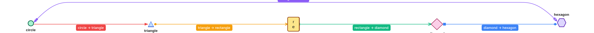
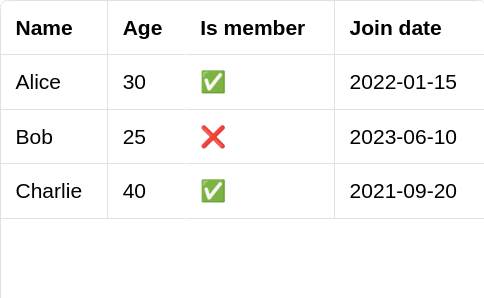
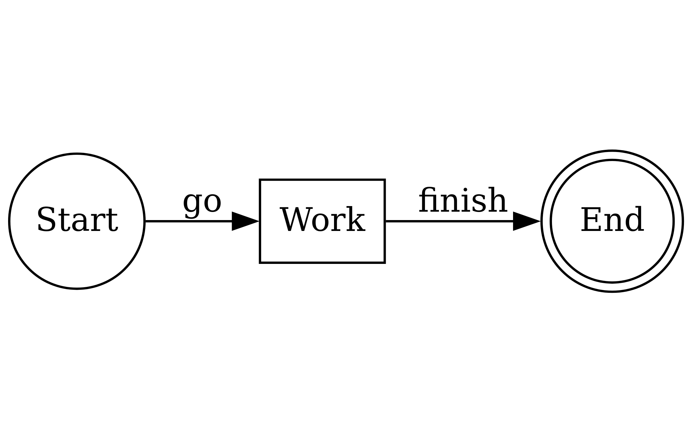
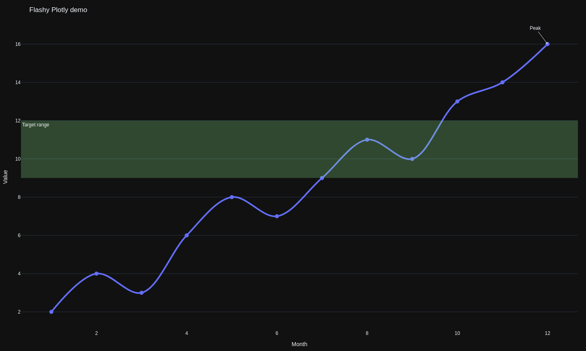
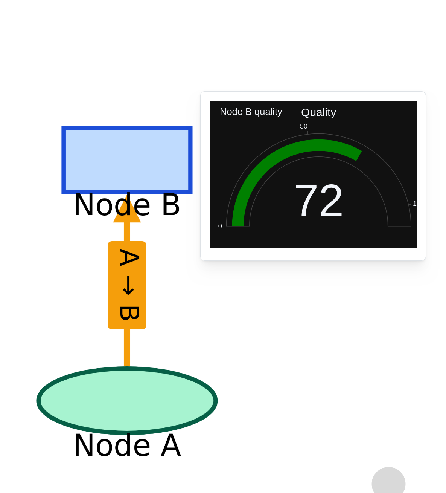

Resources are the main mechanism to define **inputs** and **outputs** of Ocelescope plugin methods.

When you define a resource, it becomes **exportable** and **importable** by default through an automatic exchange format.

Resources can also provide a visualization so they can be displayed in the frontend.

<div
  style="
    display: inline-block;
    background: white;
    padding: 1rem;
    border-radius: 0.75rem;
  "
>
  
</div>

## Defining a resource

Define a resource by creating a Python class that inherits from `Resource` (from the `ocelescope` package). The structure of the resource is described through typed fields on the class. You can also set `label` and `description` to control how the resource appears in the frontend.

If you want to reuse a resource across plugins, keep the **class name** and the **field definitions** identical.

```python title="Example: defining a resource"
from ocelescope import Resource

class Example(Resource):
    label = "Example Resource"
    description = "An example resource definition"

    property_a: str
    property_b: list[int]
```

:::caution[Resources must be JSON-serializable]

For import and export to work, a resource must be serializable and instantiable from its serialized form.

Use standard types like `str`, `int`, `float`, `bool`, `list`, or `dict`, or custom types that are themselves serializable.

If you use nested classes (for example, a resource that contains nodes and edges), make those nested classes Pydantic models (inherit from `pydantic.BaseModel`) so they can be validated and serialized consistently.

```python
from pydantic import BaseModel
from ocelescope import Resource

class Node(BaseModel):
    id: str
    label: str

class Edge(BaseModel):
    source: str
    target: str
    label: str | None = None

class GraphResource(Resource):
    nodes: list[Node]
    edges: list[Edge]

# Quick round-trip check (serialize -> create again)
GraphResource(
    GraphResource(
        nodes=[Node(id="n1", label="Start"), Node(id="n2", label="End")],
        edges=[Edge(source="n1", target="n2", label="go")]
    ).model_dump()
)
```

:::

## Using resources in plugin methods

Ocelescope inspects the **type hints** of plugin methods. Resource types used as parameters are treated as **resource inputs**, and resource types used as the return type are treated as **resource outputs** and saved in the session for later use.

```python title="Resources as input and output"
from ocelescope import Plugin, Resource, plugin_method

class MyResource(Resource):
    label = "My Resource"
    description = "Example resource"
    value: int

class ExamplePlugin(Plugin):
    label = "Example Plugin"
    description = "Shows how resources are registered via type hints"
    version = "1.0"

    @plugin_method(label="Increment resource")
    def increment(self, x: MyResource) -> MyResource:
        return MyResource(value=x.value + 1)
```

## Visualizing resources

Resources can provide a visualization so they can be displayed in the frontend. To do this, implement a `visualize()` method on your resource that returns one of the visualization classes provided by Ocelescope.

:::note[A simple example is to return a Plotly figure from your resource]

```python
from ocelescope import Resource
from ocelescope.visualization.default.plotly import Plotly

import plotly.graph_objects as go


class Curve(Resource):
    x: list[float]
    y: list[float]

    def visualize(self) -> Plotly:
        fig = go.Figure(data=go.Scatter(x=self.x, y=self.y, mode="lines"))
        fig.update_layout(title="Curve")
        return Plotly(figure=fig)
```

:::

### Overview

| Class | Use case |
| --- | --- |
| `Graph` | Interactive node/edge graph visualizations. |
| `DotVis` | Rendering raw Graphviz DOT when you already have a DOT string. |
| `SVGVis` | Render SVG markup. Useful when you generate SVG with another library (for example Matplotlib). |
| `Table` | Displaying structured data as a typed table (rows + columns). |
| `Plotly` | Interactive charts built with Plotly. |

### Examples

#### Basic graph example (`Graph`)

<details>
<summary><strong>Code</strong></summary>

```python
from ocelescope import Resource
from ocelescope.visualization.default.graph import (
    Graph,
    GraphEdge,
    GraphNode,
    LayoutConfig,
)

class GraphExample(Resource):
    label = "Graph example (complex)"
    description = "A connected graph that shows all node shapes with colorful edges."

    def visualize(self) -> Graph:
        nodes = [
            GraphNode(
                id="n_circle",
                label="circle",
                shape="circle",
                color="#A7F3D0",
                border_color="#065F46",
                label_pos="bottom",
                width=20,
                height=20,
                rank="source",
            ),
            GraphNode(
                id="n_triangle",
                label="triangle",
                shape="triangle",
                color="#BFDBFE",
                border_color="#1D4ED8",
                label_pos="bottom",
                width=20,
                height=20,
            ),
            GraphNode(
                id="n_rectangle",
                label="rectangle",
                shape="rectangle",
                color="#FDE68A",
                border_color="#92400E",
                label_pos="center",
                width=40,
                height=50,
            ),
            GraphNode(
                id="n_diamond",
                label="diamond",
                shape="diamond",
                color="#FBCFE8",
                border_color="#9D174D",
                label_pos="bottom",
                width=40,
                height=40,
            ),
            GraphNode(
                id="n_hexagon",
                label="hexagon",
                shape="hexagon",
                color="#DDD6FE",
                border_color="#5B21B6",
                label_pos="top",
                width=30,
                height=30,
                rank="sink",
            ),
        ]

        edges = [
            GraphEdge(
                source="n_circle",
                target="n_triangle",
                label="circle → triangle",
                color="#EF4444",
                start_arrow=None,
                end_arrow="triangle",
            ),
            GraphEdge(
                source="n_triangle",
                target="n_rectangle",
                label="triangle → rectangle",
                color="#F59E0B",
                start_arrow="circle",
                end_arrow="chevron",
            ),
            GraphEdge(
                source="n_rectangle",
                target="n_diamond",
                label="rectangle → diamond",
                color="#10B981",
                start_arrow="tee",
                end_arrow="vee",
            ),
            GraphEdge(
                source="n_diamond",
                target="n_hexagon",
                label="diamond → hexagon",
                color="#3B82F6",
                start_arrow="square",
                end_arrow="diamond",
            ),
            GraphEdge(
                source="n_hexagon",
                target="n_circle",
                label="hexagon → circle",
                color="#8B5CF6",
                start_arrow="triangle-cross",
                end_arrow="circle-triangle",
            ),
        ]

        return Graph(
            nodes=nodes,
            edges=edges,
            layout_config=LayoutConfig(
                elk_options={
                    "elk.algorithm": "layered",
                    "elk.direction": "RIGHT",
                    "elk.spacing.nodeNode": "40",
                    "elk.layered.spacing.nodeNodeBetweenLayers": "60",
                }
            ),
        )
```

</details>

<div
  style="
    display: inline-block;
    background: white;
    padding: 1rem;
    border-radius: 0.75rem;
  "
>
  
</div>

#### SVG through markup (`SVGVis`)

<details>
<summary><strong>Code</strong></summary>

```python
from ocelescope import Resource
from ocelescope.visualization.default.svg import SVGVis

class MyRawSVGResource(Resource):
    label = "SVG example (raw markup)"
    description = "Render raw SVG markup."

    def visualize(self) -> SVGVis:
        svg = """
        <svg xmlns="http://www.w3.org/2000/svg" width="420" height="140">
          <rect x="10" y="10" width="400" height="120" rx="10" fill="#f3f4f6"/>
          <text x="25" y="40" font-size="18" fill="#111827">SVGVis demo</text>

          <circle cx="70" cy="85" r="22" fill="#f59e0b"/>
          <rect x="120" y="65" width="80" height="40" rx="6" fill="#60a5fa"/>
          <polygon points="250,105 230,65 270,65" fill="#34d399"/>

          <text x="310" y="92" font-size="14" fill="#374151">Raw SVG markup</text>
        </svg>
        """
        return SVGVis(svg=svg)
```

</details>


#### SVG through Matplotlib (`SVGVis`)

<details>
<summary><strong>Code</strong></summary>

```python
import io

from ocelescope import Resource
from ocelescope.visualization.default.svg import SVGVis

class MyMatplotlibSVGResource(Resource):
    label = "SVG example (Matplotlib)"
    description = "Generate SVG with Matplotlib and render it."

    def visualize(self) -> SVGVis:
        # Keep the import inside the method so the plugin still loads
        # even if Matplotlib is not installed.
        try:
            import matplotlib.pyplot as plt
        except ImportError:
            return SVGVis(
                svg="""
                <svg xmlns="http://www.w3.org/2000/svg" width="520" height="80">
                  <rect x="10" y="10" width="500" height="60" rx="10" fill="#FEF3C7"/>
                  <text x="25" y="48" font-size="14" fill="#92400E">
                    Matplotlib is not installed in this environment.
                  </text>
                </svg>
                """
            )

        fig, ax = plt.subplots()
        ax.plot([0, 1, 2], [0, 1, 0], marker="o")
        ax.set_title("Matplotlib SVG demo")

        buffer = io.StringIO()
        fig.savefig(buffer, format="svg", bbox_inches="tight")
        plt.close(fig)

        return SVGVis(svg=buffer.getvalue())
```

</details>


#### Table (`Table`)

<details>
<summary><strong>Code</strong></summary>

```python
from ocelescope import Resource
from ocelescope.visualization.default.table import Table, TableColumn

class MyTableResource(Resource):
    label = "Table example"
    description = "Display structured data as a typed table."

    def visualize(self) -> Table:
        return Table(
            columns=[
                TableColumn(id="name", label="Name", data_type="string"),
                TableColumn(id="age", label="Age", data_type="number"),
                TableColumn(id="member", label="Is member", data_type="boolean"),
                TableColumn(id="joined", label="Join date", data_type="date"),
            ],
            rows=[
                {"name": "Alice", "age": 30, "member": True, "joined": "2022-01-15"},
                {"name": "Bob", "age": 25, "member": False, "joined": "2023-06-10"},
                {"name": "Charlie", "age": 40, "member": True, "joined": "2021-09-20"},
            ],
        )
```

</details>

<div
  style="
    display: inline-block;
    background: white;
    padding: 1rem;
    border-radius: 0.75rem;
  "
>
  
</div>

#### Dot (`DotVis`)

<details>
<summary><strong>Code</strong></summary>

```python
from graphviz import Digraph

from ocelescope import Resource
from ocelescope.visualization.default.dot import DotVis

class MyDotResource(Resource):
    label = "DotVis example"
    description = "Render a Graphviz DOT diagram."

    def visualize(self) -> DotVis:
        dot = Digraph()
        dot.attr(rankdir="LR")

        dot.node("A", "Start", shape="circle")
        dot.node("B", "Work", shape="box")
        dot.node("C", "End", shape="doublecircle")

        dot.edge("A", "B", label="go")
        dot.edge("B", "C", label="finish")

        return DotVis.from_graphviz(
            graph=dot,
            layout_engine="dot",
        )
```

</details>

<div
  style="
    display: inline-block;
    background: white;
    padding: 1rem;
    border-radius: 0.75rem;
  "
>
  
</div>

#### Plotly (`Plotly`)

<details>
<summary><strong>Code</strong></summary>

```python
import plotly.graph_objects as go

from ocelescope import Resource
from ocelescope.visualization.default.plotly import Plotly

class PlotlyExample(Resource):
    label = "Plotly example"
    description = "Interactive charts built with Plotly."

    def visualize(self) -> Plotly:
        x = list(range(1, 13))
        y = [2, 4, 3, 6, 8, 7, 9, 11, 10, 13, 14, 16]

        fig = go.Figure()

        fig.add_trace(
            go.Scatter(
                x=x,
                y=y,
                mode="lines+markers",
                name="Signal",
                line=dict(width=4, shape="spline"),
                marker=dict(size=10),
                hovertemplate="Month %{x}<br>Value %{y}<extra></extra>",
            )
        )

        fig.add_hrect(
            y0=9,
            y1=12,
            line_width=0,
            fillcolor="lightgreen",
            opacity=0.25,
            annotation_text="Target range",
            annotation_position="top left",
        )

        fig.add_annotation(
            x=x[-1],
            y=y[-1],
            text="Peak",
            showarrow=True,
            arrowhead=3,
            ax=-30,
            ay=-40,
        )

        fig.update_layout(
            title="Flashy Plotly demo",
            template="plotly_dark",
            height=420,
            margin=dict(l=40, r=20, t=60, b=40),
            legend=dict(
                orientation="h",
                yanchor="bottom",
                y=1.02,
                xanchor="right",
                x=1,
            ),
        )

        fig.update_xaxes(title="Month", showgrid=False)
        fig.update_yaxes(title="Value", zeroline=False)

        return Plotly(figure=fig)
```

</details>

<div
  style="
    display: inline-block;
    background: white;
    padding: 1rem;
    border-radius: 0.75rem;
  "
>
  
</div>

#### Graph with annotations (`Graph`)

You can annotate Graph nodes and edges with other visualizations, which the frontend can open when the user clicks the node or edge.

<details>
<summary><strong>Code</strong></summary>

```python
import plotly.graph_objects as go

from ocelescope import Resource
from ocelescope.visualization.default.graph import Graph, GraphEdge, GraphNode, LayoutConfig
from ocelescope.visualization.default.plotly import Plotly


class InteractiveGraphExample(Resource):
    label = "Graph example (interactive annotations)"
    description = "A graph where nodes/edges have Plotly annotations."

    def visualize(self) -> Graph:
        # Node A annotation
        fig_a = go.Figure(
            data=[go.Bar(x=["Queued", "Running", "Done"], y=[3, 1, 8])],
        )
        fig_a.update_layout(
            title="Node A stats",
            template="plotly_dark",
            height=260,
            margin=dict(l=30, r=10, t=50, b=30),
        )

        # Node B annotation
        fig_b = go.Figure(
            data=[go.Indicator(mode="gauge+number", value=72, title={"text": "Quality"})],
        )
        fig_b.update_layout(
            title="Node B quality",
            template="plotly_dark",
            height=260,
            margin=dict(l=30, r=10, t=50, b=30),
        )

        # Edge annotation
        fig_edge = go.Figure(
            data=[go.Scatter(x=[1, 2, 3, 4, 5], y=[2, 3, 2, 4, 6], mode="lines+markers")],
        )
        fig_edge.update_layout(
            title="Edge throughput",
            template="plotly_dark",
            height=260,
            margin=dict(l=30, r=10, t=50, b=30),
        )

        return Graph(
            nodes=[
                GraphNode(
                    id="A",
                    label="Node A",
                    shape="circle",
                    color="#A7F3D0",
                    border_color="#065F46",
                    label_pos="bottom",
                    annotation=Plotly(figure=fig_a),
                ),
                GraphNode(
                    id="B",
                    label="Node B",
                    shape="rectangle",
                    color="#BFDBFE",
                    border_color="#1D4ED8",
                    label_pos="bottom",
                    annotation=Plotly(figure=fig_b),
                ),
            ],
            edges=[
                GraphEdge(
                    source="A",
                    target="B",
                    label="A → B",
                    color="#F59E0B",
                    end_arrow="triangle",
                    annotation=Plotly(figure=fig_edge),
                )
            ],
            layout_config=LayoutConfig(
                elk_options={
                    "elk.algorithm": "layered",
                    "elk.direction": "RIGHT",
                }
            ),
        )
```

</details>

<div
  style="
    display: inline-block;
    background: white;
    padding: 1rem;
    border-radius: 0.75rem;
  "
>
  
</div>
