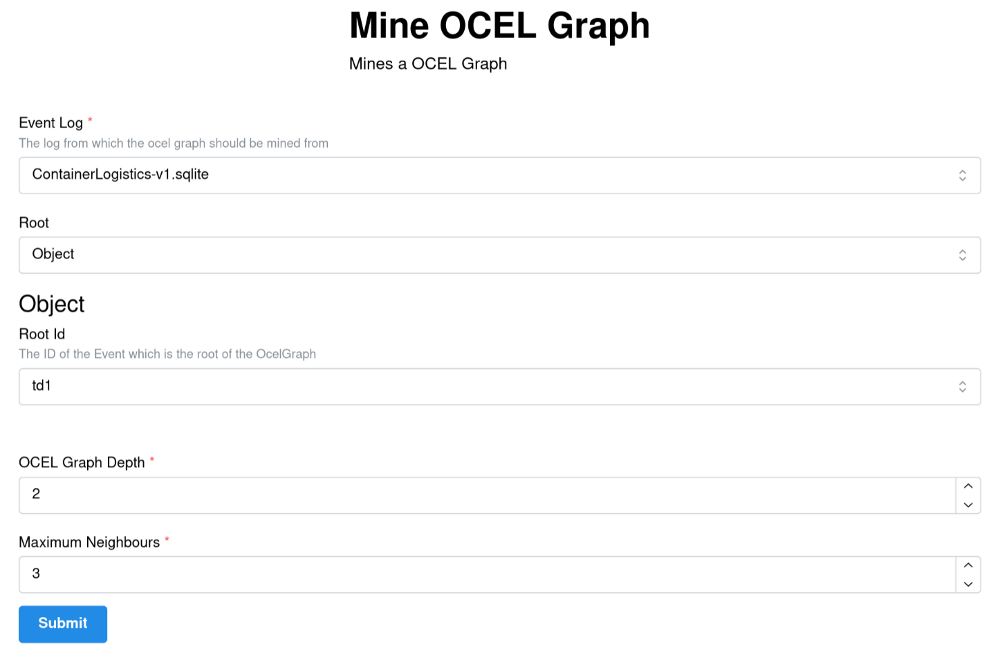
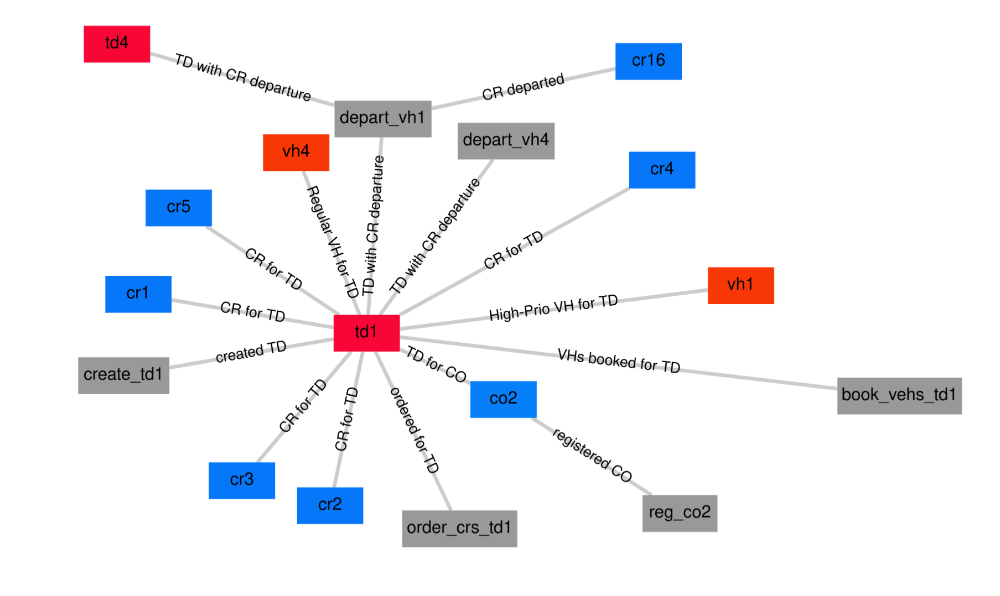

This tutorial provides a general example for developing an Ocelescope plugin from scratch.

In this tutorial, we will build an **OCEL Graph** inspired by the OCELGraph feature of the [OCPQ](https://ocpq.aarkue.eu/) tool.

An **OCEL graph** visualizes how objects and events are related to each other. The plugin lets you choose an object or event ID as the starting point (the root), and then builds a spanning tree from that root based on the connected relationships in the ocel. You can also set how far the graph should expand from the starting point.

<div style="display: flex; gap: 1rem; flex-wrap: nowrap; align-items: flex-start;">
  <div
    style="
      display: inline-block;
      padding: 1rem;
      border-radius: 0.75rem;
      width: 50%;
    "
  >
    
    <p align="center"><em>The input of the OCEL Graph</em></p>
  </div>

  <div
    style="
      display: inline-block;
      padding: 1rem;
      border-radius: 0.75rem;
      width: 50%;
    "
  >
    
    <p align="center"><em>The output of the OCEL Graph</em></p>
  </div>
</div>

:::tip[Try out OCELGraph]

You can explore the source code in the repository below, or download the plugin and try it out yourself.

- [**Download**](https://github.com/Grkmr/OcelGraph/releases/download/v1.0.2/OcelGraphDiscovery.zip)
- [**Source**](https://github.com/Grkmr/ocelgraph)

:::

:::caution[Requirements]

This project requires Python 3.13 to be installed on your system. For easy and reproducible package management, we recommend using [uv](https://docs.astral.sh/uv/).

:::

## Step 1: Setup

To get started, use the plugin template. Clone it like this:

```sh
git clone https://github.com/promi4s/plugin-template.git
cd plugin-template
```

Now install the dependencies:

```sh
uv sync
```

If you do not want to use uv, you can use any other Python package manager. For example, with pip you can run:

```sh
pip install -r requirements.txt
```

After that, your project should look similar to this:

```text
plugin-template/
├── src/
│   └── plugin-template/
│       ├── __init__.py
│       └── plugin.py
├── LICENSE
├── README.md
├── pyproject.toml
├── requirements.txt
└── uv.lock
```

The template is a minimal example. Most of your work will happen in `plugin.py`.

## Step 2: Writing the Plugin

Now we start writing the actual plugin.

### Writing Plugin Metadata

An Ocelescope plugin is defined by a **plugin class**. This class inherits from `Plugin` and contains your plugin methods.

Open `src/plugin-template/plugin.py`, find the existing plugin class, and update the class name and metadata to something like this:

```python title="src/plugin-template/plugin.py"
from ocelescope import Plugin


class OcelGraphDiscovery(Plugin):
    label = "OCEL Graph"
    description = "Generate your own OCEL Graph"
    version = "0.1.0"
```

- The class name (`OcelGraphDiscovery`) is the unique name of your plugin and helps distinguish it from other plugins.
- The label is what will be shown in the UI.
- The description briefly explains what your plugin does.
- The version lets you update your plugin over time.

### Adding a Plugin Method

Now let’s add the function that will generate the OCEL Graph.

Add a new method to your plugin class called `mine_ocel_graph`. You mark plugin methods with `@plugin_method`. The label and description you set there will be shown in the UI.

```python title="src/plugin-template/plugin.py"
from ocelescope import Plugin, plugin_method


class OcelGraphDiscovery(Plugin):
    ...

    @plugin_method(label="Mine OCEL Graph", description="Mines an OCEL Graph")
    def mine_ocel_graph(self):
        pass
```

### Planning a Plugin Method

Before you implement the method, it helps to plan what it should take as input and what it should return.

For our OCEL Graph plugin, we need the following inputs:

- `ocel`: the OCEL to analyze
- `root_id`: the root of the graph (this can be an object ID or an event ID from the log)
- `max_depth`: how far the graph should expand from the root
- `max_neighbours`: how many neighbours to include per node (so the graph does not become too large)

As output, the method should return the OCEL graph.

In Ocelescope, plugin methods can only return either an `OCEL` or a `Resource`.  
So we will implement the OCEL Graph as a custom `Resource` and return that.

<div
  style="
    display: inline-block;
    background: white;
    padding: 1rem;
    border-radius: 0.75rem;
  "
>
  
</div>

### Adding an OCEL Input

Since we want to build an OCEL Graph, our method needs an OCEL as input.  
You can add it by adding an `ocel: OCEL` parameter to `mine_ocel_graph`:

```python title="src/plugin-template/plugin.py"
from ocelescope import OCEL
from ocelescope import Plugin, plugin_method


class OcelGraphDiscovery(Plugin):
    ...

    @plugin_method(label="Mine OCEL Graph", description="Mines an OCEL Graph")
    def mine_ocel_graph(self, ocel: OCEL):
        pass
```

To make this input nicer in the UI, you can add a label and description with `OCELAnnotation`.  
For that, wrap the type using `Annotated[...]`:

```python title="src/plugin-template/plugin.py"
from typing import Annotated

from ocelescope import OCEL, OCELAnnotation
from ocelescope import Plugin, plugin_method


class OcelGraphDiscovery(Plugin):
    ...

    @plugin_method(label="Mine OCEL Graph", description="Mines an OCEL Graph")
    def mine_ocel_graph(
        self,
        ocel: Annotated[
            OCEL,
            OCELAnnotation(
                label="Event Log",
                description="The log from which the OCEL graph should be mined",
            ),
        ],
    ):
        pass
```

Now users will see a friendly label and description when selecting the OCEL input in the UI.

### Adding a Configuration Input

Now we add the remaining settings (`root_id`, `max_depth`, `max_neighbours`).  
For that, we create a **configuration input** class.

Create a new file called `input.py` next to `plugin.py`. In it, create a class called `OCELGraphInput` that inherits from `PluginInput`:

```python title="src/plugin-template/input.py"
from ocelescope import PluginInput


class OCELGraphInput(PluginInput):
    pass
```

Now extend `OCELGraphInput` with two numeric settings:

- the maximum depth of the OCEL graph
- the maximum number of neighbours per node

Use Pydantic’s [`Field`](https://docs.pydantic.dev/latest/concepts/fields/) to set titles, descriptions, defaults, and constraints:

```python title="src/plugin-template/input.py"
from ocelescope import PluginInput
from pydantic import Field


class OCELGraphInput(PluginInput, frozen=True):
    depth: int = Field(
        title="OCEL Graph Depth",
        description="The maximum depth of the OCEL graph",
        default=3,
        gt=0,
        le=10,
    )

    max_neighbours: int = Field(
        title="Maximum Neighbours",
        description="The maximum amount of neighbours a node can have",
        default=5,
        gt=0,
    )
```

Next, we need a way for users to select the **root** of the graph.  
The root can be either:

- an object ID, or
- an event ID

To let users select the root, we define two small input models:

- `ObjectRoot` for selecting an object by its ID
- `EventRoot` for selecting an event by its ID

Both models use `OCEL_FIELD`.  
This links the field to the selected OCEL log, so the UI can offer autocomplete and validation.

:::caution[Important]

The `ocel_id` in `OCEL_FIELD` must match the name of your OCEL parameter in the plugin method.  
In our case the parameter is named `ocel`, so we use `ocel_id="ocel"`.

:::

```python title="src/plugin-template/input.py"
from pydantic import BaseModel
from ocelescope import OCEL_FIELD


class ObjectRoot(BaseModel):
    class Config:
        title = "Object"  # Better readability in UI

    object_id: str = OCEL_FIELD(
        field_type="object_id",
        title="Object ID",
        ocel_id="ocel",
        description="The ID of the object that should be used as the root of the OCEL Graph",
    )


class EventRoot(BaseModel):
    class Config:
        title = "Event"  # Better readability in UI

    event_id: str = OCEL_FIELD(
        field_type="event_id",
        title="Event ID",
        ocel_id="ocel",
        description="The ID of the event that should be used as the root of the OCEL Graph",
    )
```

Now combine both options in `OCELGraphInput` using a union type (`ObjectRoot | EventRoot`):

```python title="src/plugin-template/input.py"
from ocelescope import PluginInput
from pydantic import Field


class OCELGraphInput(PluginInput, frozen=True):
    root: ObjectRoot | EventRoot

    depth: int = Field(
        title="OCEL Graph Depth",
        description="The maximum depth of the OCEL graph",
        default=3,
        gt=0,
        le=10,
    )

    max_neighbours: int = Field(
        title="Maximum Neighbours",
        description="The maximum amount of neighbours a node can have",
        default=5,
        gt=0,
    )
```

This will create an input form like this:

<div
  style="
    display: inline-block;
    background: white;
    padding: 1rem;
    border-radius: 0.75rem;
  "
>
  
</div>

### Adding the Configuration Input to the plugin method

Now we can use `OCELGraphInput` as the configuration input for our plugin method.

Import the input class and add it as a parameter named `input`:

```python title="src/plugin-template/plugin.py"
from typing import Annotated

from ocelescope import OCEL, OCELAnnotation, Plugin, plugin_method

from .input import OCELGraphInput


class OcelGraphDiscovery(Plugin):
    ...

    @plugin_method(label="Mine OCEL Graph", description="Mines an OCEL Graph")
    def mine_ocel_graph(
        self,
        ocel: Annotated[
            OCEL,
            OCELAnnotation(
                label="Event Log",
                description="The log from which the OCEL graph should be mined",
            ),
        ],
        input: OCELGraphInput,
    ):
        ...
```

:::caution[Important]

Each plugin method can have **exactly one** `PluginInput` parameter. It must be named `input`.

:::

### Defining a Resource

Now that we have the inputs, we can define the output.

Our plugin should return an **OCEL Graph**. In Ocelescope, custom outputs are implemented as **resources**.  
A resource is a Python class that inherits from `Resource`.

Create a new file called `resource.py` next to `plugin.py` and define the resource like this:

```python title="src/plugin-template/resource.py"
from pydantic import BaseModel
from ocelescope import Resource


class EventNode(BaseModel):
    id: str
    activity: str


class ObjectNode(BaseModel):
    id: str
    object_type: str


class Relation(BaseModel):
    qualifier: str
    source: str
    target: str
    object_type: str | None = None


class OCELGraph(Resource):
    label = "OCEL Graph"
    description = "An OCEL graph"

    events: list[EventNode] = []
    objects: list[ObjectNode] = []
    relations: list[Relation] = []
```

:::caution[Important]

Any nested types you use inside a resource (like `EventNode`, `ObjectNode`, or `Relation`) should inherit from Pydantic’s `BaseModel`.  
This makes sure the resource can be validated and serialized correctly.

:::

You can also add helper properties or methods to your resource. For example:

```python title="src/plugin-template/resource.py"
class OCELGraph(Resource):
    ...

    @property
    def event_ids(self) -> list[str]:
        return [event.id for event in self.events]

    @property
    def object_ids(self) -> list[str]:
        return [obj.id for obj in self.objects]
```

Finally, make sure your plugin method returns your resource by adding it as the return type:

```python title="src/plugin-template/plugin.py"
from .resource import OCELGraph


class OcelGraphDiscovery(Plugin):
    ...

    def mine_ocel_graph(...) -> OCELGraph:
        ...
```

#### Visualization

At this point, `OCELGraph` can already be returned as a resource.  
But it is only a data structure. By default, it has no visualization in the frontend.

To visualize the resource in Ocelescope, add a `visualize()` method.  
This method returns one of Ocelescope’s visualization objects, for example `Graph`.

Add this to your `OCELGraph` class:

```python title="src/plugin-template/resource.py"
from ocelescope.visualization.default.graph import (
    Graph,
    GraphEdge,
    GraphNode,
    GraphvizLayoutConfig,
)
from ocelescope.visualization.util.color import generate_color_map


class OCELGraph(Resource):
    ...

    def visualize(self) -> Graph:
        color_map = generate_color_map(
            list(set([obj.object_type for obj in self.objects]))
        )

        object_nodes = [
            GraphNode(
                id=obj.id,
                shape="rectangle",
                label=obj.id,
                color=color_map[obj.object_type],
            )
            for obj in self.objects
        ]

        event_nodes = [
            GraphNode(
                id=event.id,
                shape="rectangle",
                label=event.id,
            )
            for event in self.events
        ]

        edges = [
            GraphEdge(
                source=rel.source,
                target=rel.target,
                label=rel.qualifier,
                color=color_map[rel.object_type] if rel.object_type else None,
            )
            for rel in self.relations
        ]

        return Graph(
            type="graph",
            nodes=object_nodes + event_nodes,
            edges=edges,
            layout_config=GraphvizLayoutConfig(
                engine="neato",
                graphAttrs={"overlap": "prism"},
            ),
        )
```

Now your resource will show up as an interactive graph in the frontend:

<div
  style="
    display: inline-block;
    background: white;
    padding: 1rem;
    border-radius: 0.75rem;
  "
>
  
</div>

### Implementing the Plugin Method

Now you can implement the plugin method that transforms your input (the OCEL and configuration) and returns your resource.

For this tutorial, we won’t go into the implementation details.  
Instead, we will put the logic in a utility function to keep `plugin.py` clean and readable.

Download `util.py` and add it next to `plugin.py`:

```text
src/plugin-template/
├── plugin.py
└── util.py
```

Now import the function and return its result:

```python title="src/plugin-template/plugin.py"
from ocelescope import OCEL, Plugin, plugin_method

from .input import OCELGraphInput
from .resource import OCELGraph
from .util import mine_ocel_graph


class OcelGraphDiscovery(Plugin):
    ...

    @plugin_method(label="Mine OCEL Graph", description="Mines an OCEL Graph")
    def mine_ocel_graph(self, ocel: OCEL, input: OCELGraphInput) -> OCELGraph:
        return mine_ocel_graph(ocel, input)
```

:::caution[Relative imports only]

Currently, **Ocelescope plugins only support relative imports**.  
This means all imports inside your plugin must use relative paths:

```python title="src/plugin-template/plugin.py"
# ✅ Correct (relative import)
from .input import OCELGraphInput
from .resource import OCELGraph
from .util import mine_ocel_graph

# ❌ Incorrect (absolute import)
from plugin_template.input import OCELGraphInput
from plugin_template.resource import OCELGraph
from plugin_template.util import mine_ocel_graph
```

:::

## Step 3: Build Plugin

Before you build the plugin, make sure your package exposes the plugin class at the top level.

Open `src/plugin-template/__init__.py` and export your plugin class:

```python title="src/plugin-template/__init__.py"
from .plugin import OcelGraphDiscovery

__all__ = [
    "OcelGraphDiscovery",
]
```

Ocelescope plugins are distributed as a **zipped Python package**. After building, your zip should look like this:

```text
plugin.zip/
├─ ocel_graph/
│  ├─ __init__.py
│  ├─ plugin.py
│  ├─ util.py
│  ├─ input.py
│  ├─ resource.py
```

You can create the zip manually, but it is easier to use the build command.

Run this from the project root:

```sh
ocelescope build
```

Or, if you are using `uv`:

```sh
uv run ocelescope build
```

The build script also checks for absolute imports and raises an error if it finds any.  
That’s it. You can now upload the zip from `dist/` to an Ocelescope instance and run your plugin.
